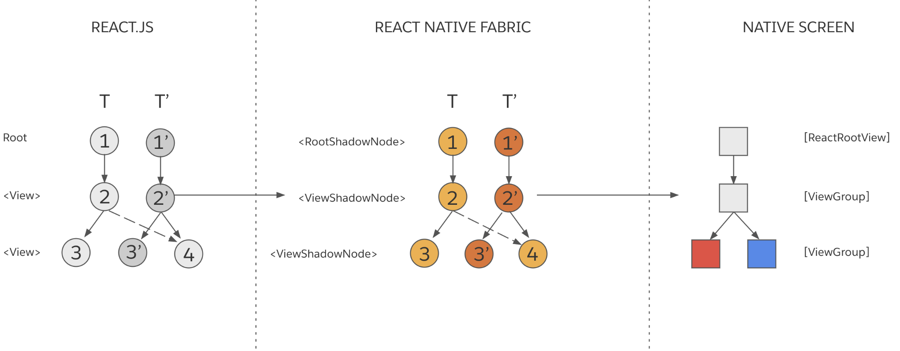
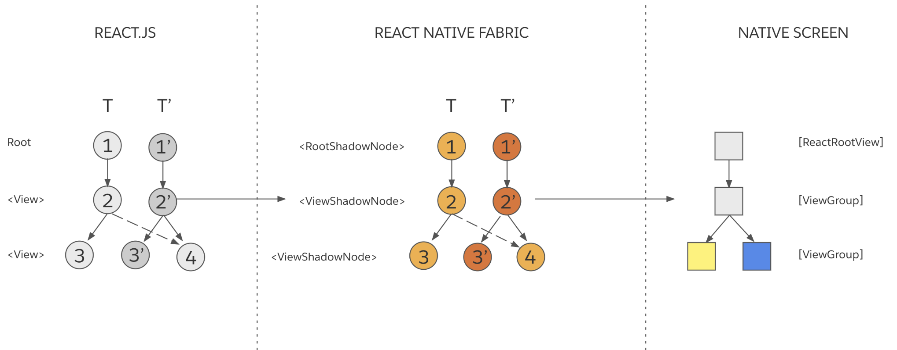

# Render, Commit и Mount

Рендерер React Native проходит последовательность работ для рендеринга логики React на [хост-платформу](architecture-glossary.md#host-platform). Эта последовательность работ называется конвейером рендеринга и выполняется для начального рендеринга и обновления состояния пользовательского интерфейса. В этом документе рассматривается конвейер рендеринга и его различия в этих сценариях.

Конвейер рендеринга можно разбить на три общие фазы:

1.  **Рендер:** React выполняет логику продукта, которая создает [React Element Trees](architecture-glossary.md#react-element-tree-and-react-element) на JavaScript. Из этого дерева рендерер создает [React Shadow Tree](architecture-glossary.md#react-shadow-tree-and-react-shadow-node) на C++.
2.  **Коммит**: После полного создания React Shadow Tree рендерер запускает коммит. Это **продвигает** как React Element Tree, так и вновь созданное React Shadow Tree в качестве "следующего дерева", которое будет смонтировано. Это также планирует вычисление информации о его компоновке.
3.  **Монтаж:** Дерево теней React, теперь с результатами расчета компоновки, преобразуется в [Host View Tree](architecture-glossary.md#host-view-tree-and-host-view).

!!!warning ""

    Фазы конвейера рендеринга могут происходить в разных потоках. Более подробную информацию см. в документе [Threading Model](threading-model.md) doc.


## Начальный рендеринг

Представьте, что вы хотите отобразить следующее:

```js
function MyComponent() {
    return (
        <View>
            <Text>Hello, World</Text>
        </View>
    );
}

// <MyComponent />
```

В приведенном выше примере `<MyComponent />` является [React Element](architecture-glossary.md#react-element-tree-and-react-element). React рекурсивно уменьшает этот _React-элемент_ до конечного [React Host-компонента](architecture-glossary.md#react-host-components-or-host-components), вызывая его (или его метод `render`, если он реализован с помощью класса JavaScript), пока каждый _React-элемент_ не сможет быть уменьшен еще больше. Теперь у вас есть дерево _React-элементов_ [React Host Components](architecture-glossary.md#react-host-components-or-host-components).

### Фаза 1. Рендеринг


Во время этого процесса сокращения элементов, когда вызывается каждый _React Element_, рендерер также синхронно создает [React Shadow Node](architecture-glossary.md#react-shadow-tree-and-react-shadow-node). Это происходит только для _React Host Components_, но не для [React Composite Components](architecture-glossary.md#react-composite-components). В приведенном выше примере `<View>` приводит к созданию объекта `ViewShadowNode`, а объект
`<Text>` приводит к созданию объекта `TextShadowNode`. Примечательно, что никогда не существует _React Shadow Node_, который непосредственно представляет `<МойКомпонент>`.

Всякий раз, когда React создает отношения родитель-ребенок между двумя _React Element Nodes_, рендерер создает такие же отношения между соответствующими _React Shadow Nodes_. Так собирается _React Shadow Tree_.

**Дополнительные сведения**

-   Операции (создание _React Shadow Node_, создание отношений родитель-ребенок между двумя _React Shadow Node_) являются синхронными и потокобезопасными операциями, которые выполняются из React (JavaScript) в рендерер (C++), обычно в потоке JavaScript.
-   Дерево _React Element Tree_ (и составляющие его _React Element Nodes_) не существует бесконечно. Это временное представление, материализованное "волокнами" в React. Каждое "волокно", представляющее компонент узла, хранит указатель C++ на _React Shadow Node_, что стало возможным благодаря JSI. [Подробнее о "волокнах" в этом документе](https://github.com/acdlite/react-fiber-architecture#what-is-a-fiber).
-   Дерево _React Shadow Tree_ является неизменяемым. Чтобы обновить любой _React Shadow Node_, рендерер создает новое _React Shadow Tree_. Однако рендерер предоставляет операции клонирования, чтобы сделать обновление состояния более производительным (подробнее см. в [React State Updates](render-pipeline.md#react-state-updates)).

В приведенном выше примере результат фазы рендеринга выглядит следующим образом:


После завершения работы _React Shadow Tree_ рендерер запускает фиксацию _React Element Tree_.

### Фаза 2. Коммит


Фаза фиксации состоит из двух операций: _Расчет макета_ и _Продвижение дерева_.

-   **Расчет макета:** Эта операция вычисляет положение и размер каждого _React Shadow Node_. В React Native это включает вызов Yoga для расчета расположения каждого _React Shadow Node_. Для фактического расчета требуются стили каждого _React Shadow Node_, которые берутся из _React Element_ в JavaScript. Для этого также требуются ограничения компоновки корня _React Shadow Tree_, которые определяют количество свободного пространства, которое могут занимать результирующие узлы.


-   **Продвижение дерева (Новое дерево → Следующее дерево):** Эта операция продвигает новое _React Shadow Tree_ в качестве "следующего дерева", которое должно быть смонтировано. Это продвижение указывает на то, что новое _React Shadow Tree_ имеет всю информацию для монтирования и представляет собой последнее состояние _React Element Tree_. Следующее дерево" монтируется при следующем "тике" UI Thread.

**Дополнительные сведения**

-   Эти операции выполняются асинхронно в фоновом потоке.
-   Большинство расчетов компоновки выполняется полностью в C++. Однако, расчет компоновки некоторых компонентов зависит от _хост-платформы_ (например, `Text`, `TextInput` и т.д.). Размер и положение текста специфичны для каждой _хост-платформы_ и должны быть рассчитаны на уровне _хост-платформы_. Для этого Yoga вызывает функцию, определенную в _хост-платформе_, чтобы рассчитать расположение компонента.

### Фаза 3. Монтирование


Фаза монтажа преобразует _React Shadow Tree_ (которое теперь содержит данные из расчета компоновки) в _Host_ _View Tree_ с отрисованными пикселями на экране. В качестве напоминания, _React Element Tree_ выглядит следующим образом:

```jsx
<View>
    <Text>Hello, World</Text>
</View>
```

На высоком уровне рендерер React Native создает соответствующий [Host View](architecture-glossary.md#host-view-tree-and-host-view) для каждого _React Shadow Node_ и монтирует его на экран. В приведенном выше примере рендерер создает экземпляр `android.view.ViewGroup` для `<View>` и `android.widget.TextView` для `<Text>` и заполняет его текстом "Hello World". Аналогично для iOS создается `UIView` и текст заполняется вызовом `NSLayoutManager`. Затем каждое представление узла настраивается на использование props из своего узла React Shadow, а его размер и положение настраиваются с помощью рассчитанной информации о макете.


Более подробно, этап монтажа состоит из следующих трех шагов:

-   **Дифференцирование деревьев:** Этот шаг вычисляет разницу между "ранее отрисованным деревом" и "следующим деревом" полностью на C++. Результатом является список атомарных операций мутации, которые должны быть выполнены над представлениями хоста (например, `createView`, `updateView`, `removeView`, `deleteView` и т.д.). На этом этапе также происходит сглаживание дерева теней React Shadow Tree, чтобы избежать создания ненужных хост-представлений. Подробности об этом алгоритме смотрите в [View Flattening](view-flattening.md).
-   **Продвижение дерева (следующее дерево → рендерированное дерево)**: Этот шаг атомарно продвигает "следующее дерево" к "ранее отрендеренному дереву", чтобы на следующем этапе монтирования вычислить diff относительно соответствующего дерева.
-   **Видовой монтаж**: Этот шаг применяет атомарные операции мутации к соответствующим представлениям хоста. Этот шаг выполняется на _хостовой платформе_ в потоке UI.

**Дополнительные сведения**

-   Операции выполняются синхронно в потоке UI. Если фаза фиксации выполняется в фоновом потоке, то фаза монтажа запланирована на следующий "тик" потока UI. С другой стороны, если фаза фиксации выполняется в потоке UI, фаза монтажа выполняется синхронно в том же потоке.
-   Планирование, реализация и выполнение фазы монтажа сильно зависит от _хостовой платформы_. Например, архитектура рендеринга монтажного слоя в настоящее время различается между Android и iOS.
-   Во время начального рендеринга "ранее отрендеренное дерево" пусто. Поэтому шаг диффиринга дерева приведет к списку операций мутации, состоящему только из создания представлений, установки реквизитов и добавления представлений друг к другу. Дифференциация деревьев становится более важной для производительности при обработке [React State Updates](#react-state-updates).
-   В текущих производственных тестах _React Shadow Tree_ обычно состоит примерно из 600-1000 _React Shadow Nodes_ (до сглаживания представлений), после сглаживания представлений деревья сокращаются до ~200 узлов. На iPad или в настольных приложениях это количество может увеличиться в 10 раз.

## Обновления состояния React

Давайте рассмотрим каждую фазу конвейера рендеринга, когда обновляется состояние _React Element Tree_. Допустим, вы отобразили следующий компонент в начальном рендере:

```jsx
function MyComponent() {
    return (
        <View>
            <View
                style={{
                    backgroundColor: 'red',
                    height: 20,
                    width: 20,
                }}
            />
            <View
                style={{
                    backgroundColor: 'blue',
                    height: 20,
                    width: 20,
                }}
            />
        </View>
    );
}
```

Применяя то, что было описано в разделе [Initial Render](#initial-render), можно ожидать создания следующих деревьев:


Обратите внимание, что **узел 3** отображается на представление узла с **красным фоном**, а **узел 4** - на представление узла с **синим фоном**. Предположим, что в результате обновления состояния в логике продукта JavaScript фон первого вложенного `<View>` меняется с `красного` на `желтый`. Вот как может выглядеть новое дерево элементов _React Element Tree_:

```js
<View>
    <View
        style={{
            backgroundColor: 'yellow',
            height: 20,
            width: 20,
        }}
    />
    <View
        style={{
            backgroundColor: 'blue',
            height: 20,
            width: 20,
        }}
    />
</View>
```

Как это обновление обрабатывается в React Native?

Когда происходит обновление состояния, рендерер должен концептуально обновить _React Element Tree_, чтобы обновить уже смонтированные представления хоста. Но чтобы сохранить безопасность потоков, как _React Element Tree_, так и _React Shadow Tree_ должны быть неизменяемыми. Это означает, что вместо изменения текущего _React Element Tree_ и _React Shadow Tree_, React должен создать новую копию каждого дерева, которая будет включать в себя новые реквизиты, стили и дочерние элементы.

Давайте рассмотрим каждый этап конвейера рендеринга во время обновления состояния.

### Фаза 1. Рендеринг


Когда React создает новое _React Element Tree_, включающее новое состояние, он должен клонировать каждый _React Element_ и _React Shadow Node_, на которые повлияло изменение. После клонирования новое _React Shadow Tree_ фиксируется.

Рендерер React Native использует структурное разделение для минимизации накладных расходов на неизменяемость. Когда _React-элемент_ клонируется для включения нового состояния, клонируется каждый _React-элемент_, находящийся на пути к корню. **React клонирует React-элемент, только если требуется обновление его реквизитов, стиля или дочерних элементов.** Любые _React-элементы_, которые не изменились в результате обновления состояния, разделяются между старым и новым деревьями.

В приведенном выше примере React создает новое дерево с помощью этих операций:

1. CloneNode(**Node 3**, {backgroundColor: 'yellow'}) → **Node 3'**.
2. CloneNode(**Node 2**) → **Node 2'**.
3. AppendChild(**Узел 2'**, **Узел 3'**)
4. AppendChild(**Узел 2'**, **Узел 4**)
5. CloneNode(**Node 1**) → **Node 1'**
6. AppendChild(**Узел 1'**, **Узел 2'**)

После этих операций **узел 1'** представляет собой корень нового дерева _React Element Tree_. Давайте присвоим **T** "ранее отрисованному дереву" и **T'** "новому дереву":



Обратите внимание, что **T** и **T'** оба используют **узел 4**. Совместное использование структур повышает производительность и снижает использование памяти.

### Фаза 2. Коммит


После того как React создаст новые _React Element Tree_ и _React Shadow Tree_, он должен зафиксировать их.

-   **Расчет макета:** Аналогичен расчету макета во время [Initial Render](#initial-render). Важным отличием является то, что расчет макета может привести к клонированию общих _React Shadow Nodes_. Это может произойти потому, что если родитель общего _React Shadow Node_ изменит расположение, расположение общего _React Shadow Node_ также может измениться.
-   **Продвижение дерева (новое дерево → следующее дерево):** Аналогично продвижению дерева во время [Initial Render](#initial-render).

-   **Дифференцирование деревьев:** Этот шаг вычисляет разницу между "ранее отрендеренным деревом" (**T**) и "следующим деревом" (**T'**). Результатом является список атомарных мутационных операций, которые должны быть выполнены над _хостовыми представлениями_.

    -   В приведенном выше примере операции состоят из: `UpdateView(**Node 3'**, {backgroundColor: ''yellow'})`.

### Фаза 3. Монтирование


-   **Продвижение дерева (следующее дерево → рендерированное дерево)**: Этот шаг атомарно переводит "следующее дерево" в "ранее отрендеренное дерево", чтобы на следующей фазе монтирования вычислить разницу с соответствующим деревом.
    Diff может быть вычислен для любого смонтированного в данный момент дерева с любым новым деревом. Рендерер может пропустить некоторые промежуточные версии дерева.
-   **Монтирование вида**: Этот этап применяет атомарные операции мутации к соответствующим _хостовым представлениям_. В приведенном выше примере только `backgroundColor` вида **View 3** будет обновлен (на желтый).



## Обновления состояния рендерера React Native

Для большинства информации в _Shadow Tree_, React является единственным владельцем и единственным источником правды. Все данные исходят из React, и поток данных идет в одном направлении.

Однако есть одно исключение и важный механизм: компоненты на C++ могут содержать состояние, которое не подвергается прямому воздействию JavaScript, и JavaScript не является источником истины. C++ и _Host Platform_ контролируют это _C++ State_. Как правило, это актуально только в том случае, если вы разрабатываете сложный _Host-компонент_, которому требуется _C++ State_. Подавляющему большинству _Host-компонентов_ эта функциональность не нужна.

Например, `ScrollView` использует этот механизм, чтобы сообщить рендереру о текущем смещении. Обновление запускается с _хостовой платформы_, в частности, с хостового представления, которое представляет компонент `ScrollView`. Информация о смещении используется в API типа [measure](direct-manipulation.md#measurecallback). Поскольку это обновление исходит от платформы хоста и не влияет на дерево элементов React, эти данные о состоянии хранятся в _C++ State_.

Концептуально обновления _C++ State_ похожи на описанные выше [React State Updates](render-pipeline.md#react-state-updates).
С двумя важными отличиями:

1.  Они пропускают "фазу рендеринга", поскольку React не задействован.
2.  Обновления могут возникать и происходить в любом потоке, включая основной поток.

### Фаза 2. Коммит


При выполнении обновления _C++ State_ блок кода запрашивает обновление `ShadowNode` (**N**) для установки _C++ State_ в значение **S**. Рендерер React Native будет неоднократно пытаться получить последнюю зафиксированную версию **N**, клонировать ее с новым состоянием **S** и зафиксировать **N'** в дереве. Если за это время React или другое обновление _C++ State_ выполнило другую фиксацию, фиксация _C++ State_ будет неудачной, и рендерер будет повторять попытку обновления _C++ State_ много раз, пока фиксация не будет успешной. Это предотвращает столкновения и гонки источников истинности.

### Фаза 3. Монтирование


Фаза _Mount Phase_ практически идентична [Mount Phase of React State Updates](#react-state-updates). Рендерер все еще должен пересчитать компоновку, выполнить разделение дерева и т.д. Подробности см. в разделах выше.
