# Flutter для разработчиков React Native

Этот документ предназначен для разработчиков React Native (RN), желающих применить имеющиеся знания о RN для создания мобильных приложений на Flutter. Если вы понимаете основы фреймворка RN, то можете использовать этот документ как способ начать изучение разработки на Flutter.

Этот документ можно использовать в качестве "поваренной книги", переходя от одного вопроса к другому и находя вопросы, наиболее соответствующие вашим потребностям.

## Введение в Dart для разработчиков JavaScript (ES6)

Как и React Native, Flutter использует представления в реактивном стиле. Однако если RN транспилируется в нативные виджеты, то Flutter компилируется полностью в нативный код. Flutter управляет каждым пикселем на экране, что позволяет избежать проблем с производительностью, связанных с необходимостью использования моста JavaScript.

Dart - простой в изучении язык, обладающий следующими возможностями:

-   Открытый масштабируемый язык программирования для создания веб-приложений, серверов и мобильных приложений.
-   Объектно-ориентированный язык с единым наследованием, использующий синтаксис в стиле C, который AOT-компилируется в native.
-   Опционально транскомпилируется в JavaScript.
-   Поддерживает интерфейсы и абстрактные классы.

Ниже приведены несколько примеров различий между JavaScript и Dart.

### Точка входа

В JavaScript нет предопределенной функции входа &mdash; точку входа определяете вы.

```js title="Javascript"
function startHere() {
    // Can be used as entry point
}
```

В Dart каждое приложение должно иметь функцию верхнего уровня `main()`, которая служит точкой входа в приложение.

```dart title="Dart"

void main() {}
```

Попробуйте это сделать в [DartPad][dartpada].

### Печать в консоль

Для печати на консоль в Dart используется функция `print()`.

```js title="Javascript"
console.log('Hello world!');
```

```dart title="Dart"

print('Hello world!');
```

Попробуйте это сделать в [DartPad][dartpadb].

### Переменные

Dart безопасен для типов &mdash; он использует комбинацию статической проверки типов и проверок во время выполнения, чтобы гарантировать, что значение переменной всегда соответствует ее статическому типу. Хотя типы являются обязательными, некоторые аннотации типов являются необязательными, поскольку Dart выполняет вывод типов.

#### Создание и присвоение переменных

В JavaScript переменные не могут быть типизированы.

В [Dart][] переменные должны быть либо явно типизированы, либо система типов должна автоматически выводить нужный тип.

```js title="Javascript"
let name = 'JavaScript';
```

```dart title="Dart"

/// Both variables are acceptable.
String name = 'dart'; // Explicitly typed as a [String].
var otherName = 'Dart'; // Inferred [String] type.
```

Попробуйте это сделать в [DartPad][dartpadc].

Более подробную информацию можно найти в разделе [Dart's Type System][].

#### Значение по умолчанию

В JavaScript неинициализированные переменные имеют значение `undefined`.

В Dart неинициализированные переменные имеют начальное значение `null`. Поскольку в Dart числа являются объектами, то даже неинициализированные переменные с числовыми типами имеют значение `null`.

!!!alert ""

    Начиная с версии 2.12, Dart поддерживает [Sound Null Safety][], все базовые типы по умолчанию являются ненулевыми, которые должны быть инициализированы как ненулевое значение.

```js title="Javascript"
let name; // == undefined
```

```dart title="Dart"
var name; // == null; raises a linter warning
int? x; // == null
```

Попробуйте это сделать в [DartPad][dartpadd].

Для получения дополнительной информации см. документацию по [variables][].

### Проверка на наличие null или нуля

В JavaScript при использовании оператора сравнения `==` значения 1 или любые ненулевые объекты рассматриваются как `true`.

```js title="Javascript"
let myNull = null;
if (!myNull) {
    console.log('null is treated as false');
}
let zero = 0;
if (!zero) {
    console.log('0 is treated as false');
}
```

В Dart только булево значение `true` рассматривается как истина.

```dart title="Dart"
var myNull;
var zero = 0;
if (zero == 0) {
  print('use "== 0" to check zero');
}
```

Попробуйте это сделать в [DartPad][dartpade].

### Функции

Функции Dart и JavaScript в целом похожи. Основное различие заключается в объявлении.

```js title="Javascript"
function fn() {
    return true;
}
```

```dart title="Dart"
/// You can explicitly define the return type.
bool fn() {
  return true;
}
```

Попробуйте это сделать в [DartPad][dartpadf].

Для получения дополнительной информации см. документацию по [functions][].

### Асинхронное программирование

#### Futures

Как и JavaScript, Dart поддерживает однопоточное выполнение. В JavaScript объект `Promise` представляет возможное завершение (или неудачу) асинхронной операции и ее результирующее значение.

В Dart для этого используются объекты [Future][].

```js title="Javascript"
class Example {
    _getIPAddress() {
        const url = 'https://httpbin.org/ip';
        return fetch(url)
            .then((response) => response.json())
            .then((responseJson) => {
                const ip = responseJson.origin;
                return ip;
            });
    }
}

function main() {
    const example = new Example();
    example
        ._getIPAddress()
        .then((ip) => console.log(ip))
        .catch((error) => console.error(error));
}

main();
```

```dart title="Dart"
import 'dart:convert';

import 'package:http/http.dart' as http;

class Example {
  Future<String> _getIPAddress() {
    final url = Uri.https('httpbin.org', '/ip');
    return http.get(url).then((response) {
      String ip = jsonDecode(response.body)['origin'];
      return ip;
    });
  }
}

void main() {
  final example = Example();
  example
      ._getIPAddress()
      .then((ip) => print(ip))
      .catchError((error) => print(error));
}
```

Для получения дополнительной информации см. документацию по объектам [Future][].

#### `async` и `await`

Объявление функции `async` определяет асинхронную функцию.

В JavaScript функция `async` возвращает `Promise`. Оператор `await` используется для ожидания `Promise`.

```js title="Javascript"
class Example {
  async function _getIPAddress() {
    const url = 'https://httpbin.org/ip';
    const response = await fetch(url);
    const json = await response.json();
    const data = json.origin;
    return data;
  }
}

async function main() {
  const example = new Example();
  try {
    const ip = await example._getIPAddress();
    console.log(ip);
  } catch (error) {
    console.error(error);
  }
}

main();
```

В Dart функция `async` возвращает `Future`, а тело функции планируется к выполнению позже. Оператор `await` используется для ожидания `Future`.

```dart title="Dart"
import 'dart:convert';

import 'package:http/http.dart' as http;

class Example {
  Future<String> _getIPAddress() async {
    final url = Uri.https('httpbin.org', '/ip');
    final response = await http.get(url);
    String ip = jsonDecode(response.body)['origin'];
    return ip;
  }
}

/// An async function returns a `Future`.
/// It can also return `void`, unless you use
/// the `avoid_void_async` lint. In that case,
/// return `Future<void>`.
void main() async {
  final example = Example();
  try {
    final ip = await example._getIPAddress();
    print(ip);
  } catch (error) {
    print(error);
  }
}
```

Более подробную информацию можно найти в документации по [async and await][].

## Основы

### Как создать приложение на Flutter?

Чтобы создать приложение с использованием React Native, необходимо выполнить команду `create-react-native-app` из командной строки.

```terminal
$ create-react-native-app <projectname>
```

Чтобы создать приложение на Flutter, выполните одно из следующих действий:

-   Используйте IDE с установленными плагинами Flutter и Dart.
-   Используйте команду `flutter create` из командной строки. Убедитесь, что Flutter SDK находится в PATH.

```terminal
$ flutter create <projectname>
```

Для получения дополнительной информации см. раздел [Getting started][], в котором рассказывается о создании приложения-счетчика нажатий на кнопки. При создании проекта Flutter собираются все файлы, необходимые для запуска примера приложения на устройствах Android и iOS.

### Как запустить приложение?

В React Native вы запускаете команду `npm run` или `yarn run` из каталога проекта.

Запускать приложения Flutter можно несколькими способами:

-   Использовать опцию "run" в IDE с плагинами Flutter и Dart.
-   Использовать команду `flutter run` из корневого каталога проекта.

Приложение запускается на подключенном устройстве, симуляторе iOS или эмуляторе Android.

Дополнительную информацию можно найти в документации Flutter [Getting started][].

### Как импортировать виджеты?

В React Native необходимо импортировать каждый требуемый компонент.

```js title="Javascript"
// React Native
import React from 'react';
import { StyleSheet, Text, View } from 'react-native';
```

Во Flutter для использования виджетов из библиотеки Material Design импортируйте пакет `material.dart`. Для использования виджетов в стиле iOS импортируйте библиотеку Cupertino. Для использования более базового набора виджетов импортируйте библиотеку Widgets. Также можно написать собственную библиотеку виджетов и импортировать ее.

```dart title="Dart"
import 'package:flutter/cupertino.dart';
import 'package:flutter/material.dart';
import 'package:flutter/widgets.dart';
import 'package:my_widgets/my_widgets.dart';
```

Какой бы пакет виджетов вы ни импортировали, Dart берет только те виджеты, которые используются в вашем приложении.

Для получения дополнительной информации см. [Flutter Widget Catalog][].

### Что является эквивалентом приложения React Native "Hello world!" во Flutter?

В React Native класс `HelloWorldApp` расширяет `React.Component` и реализует метод render, возвращая компонент представления.

```js title="Javascript"
// React Native
import React from 'react';
import { StyleSheet, Text, View } from 'react-native';

const App = () => {
    return (
        <View style={styles.container}>
            <Text>Hello world!</Text>
        </View>
    );
};

const styles = StyleSheet.create({
    container: {
        flex: 1,
        backgroundColor: '#fff',
        alignItems: 'center',
        justifyContent: 'center',
    },
});

export default App;
```

Во Flutter можно создать идентичное приложение "Hello world!", используя виджеты `Center` и `Text` из основной библиотеки виджетов. Виджет `Center` становится корнем дерева виджетов и имеет один дочерний виджет `Text`.

```dart title="Dart"
/// Flutter
import 'package:flutter/material.dart';

void main() {
  runApp(
    const Center(
      child: Text(
        'Hello, world!',
        textDirection: TextDirection.ltr,
      ),
    ),
  );
}
```

На следующих изображениях показан пользовательский интерфейс для Android и iOS для базового приложения Flutter "Hello world!".

=== "Android"

    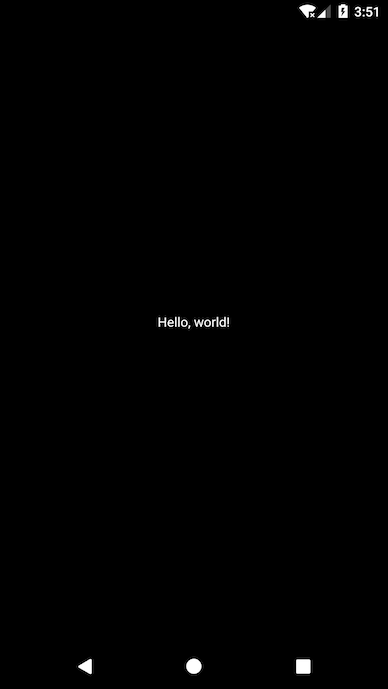

=== "iOS"

    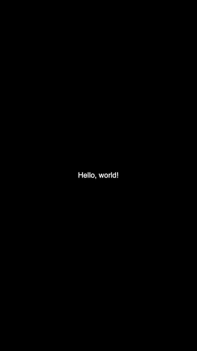

Теперь, когда вы познакомились с самым базовым приложением Flutter, в следующем разделе мы покажем, как использовать преимущества богатых библиотек виджетов Flutter для создания современного, отполированного приложения.

### Как использовать виджеты и вложить их в дерево виджетов?

Во Flutter почти все является виджетами.

Виджеты являются основными элементами пользовательского интерфейса приложения. Виджеты объединяются в иерархию, называемую деревом виджетов. Каждый виджет вложен в родительский виджет и наследует свойства от родительского. Даже сам объект приложения является виджетом. Отдельного объекта "приложение" не существует. Вместо него эту роль выполняет корневой виджет.

Виджет может определять:

-   структурный элемент, например, кнопку или меню
-   стилистический элемент, например, шрифт или цветовую схему
-   Аспект компоновки, например, подгонку или выравнивание.

В следующем примере показано приложение "Hello world!", использующее виджеты из библиотеки Material. В этом примере дерево виджетов вложено внутрь корневого виджета `MaterialApp`.

```dart title="Dart"
/// Flutter
import 'package:flutter/material.dart';

void main() => runApp(const MyApp());

class MyApp extends StatelessWidget {
  const MyApp({super.key});

  @override
  Widget build(BuildContext context) {
    return MaterialApp(
      title: 'Welcome to Flutter',
      home: Scaffold(
        appBar: AppBar(
          title: const Text('Welcome to Flutter'),
        ),
        body: const Center(
          child: Text('Hello world'),
        ),
      ),
    );
  }
}
```

На следующих изображениях показан "Hello world!", построенный на основе виджетов Material Design. Бесплатно вы получаете больше функциональности, чем в базовом приложении "Hello world!".

=== "Android"

    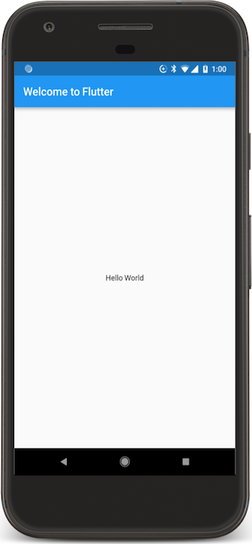

=== "iOS"

    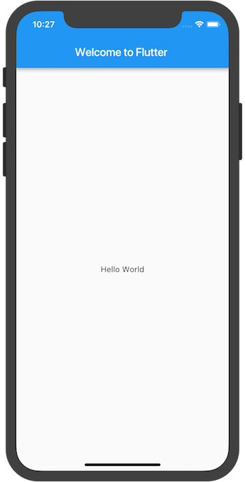

При написании приложения вы будете использовать два типа виджетов: [`StatelessWidget`][] или [`StatefulWidget`][]. Виджет `StatelessWidget` - это то, что он означает &mdash; виджет без состояния. Виджет `StatelessWidget` создается один раз и никогда не меняет своего вида. Виджет `StatefulWidget` динамически изменяет свое состояние в зависимости от получаемых данных или ввода пользователя.

Важным отличием виджетов без состояния от виджетов с состоянием является то, что у виджетов с состоянием есть объект `State`, который хранит данные о состоянии и переносит их при перестройке дерева, так что они не теряются.

В простых или базовых приложениях легко вложить виджеты, но по мере расширения кодовой базы и усложнения приложения следует разбивать глубоко вложенные виджеты на функции, возвращающие виджет или более мелкие классы. Создание отдельных функций и виджетов позволяет повторно использовать компоненты внутри приложения.

### Как создавать многократно используемые компоненты?

В React Native для создания многоразового компонента необходимо определить класс, а затем использовать методы `props` для установки или возврата свойств и значений выбранных элементов. В приведенном ниже примере определяется класс `CustomCard`, который затем используется внутри родительского класса.

```js title="Javascript"
// React Native
const CustomCard = ({ index, onPress }) => {
    return (
        <View>
            <Text> Card {index} </Text>
            <Button
                title="Press"
                onPress={() => onPress(index)}
            />
        </View>
    );
};

// Usage
<CustomCard onPress={this.onPress} index={item.key} />;
```

Во Flutter можно определить класс для создания пользовательского виджета, а затем использовать его повторно. Можно также определить и вызвать функцию, возвращающую многократно используемый виджет, как это показано в функции `build` в следующем примере.

```dart title="Dart"
/// Flutter
class CustomCard extends StatelessWidget {
  const CustomCard({
    super.key,
    required this.index,
    required this.onPress,
  });

  final int index;
  final void Function() onPress;

  @override
  Widget build(BuildContext context) {
    return Card(
        child: Column(
      children: <Widget>[
        Text('Card $index'),
        TextButton(
          onPressed: onPress,
          child: const Text('Press'),
        ),
      ],
    ));
  }
}

class UseCard extends StatelessWidget {
  const UseCard({super.key, required this.index});

  final int index;

  @override
  Widget build(BuildContext context) {
    /// Usage
    return CustomCard(
      index: index,
      onPress: () {
        print('Card $index');
      },
    );
  }
}
```

В предыдущем примере конструктор класса `CustomCard` использует синтаксис фигурных скобок Dart `{ }` для указания [named parameters][].

Чтобы затребовать эти поля, нужно либо убрать фигурные скобки из конструктора, либо добавить в конструктор `required`.

На следующих скриншотах показан пример многократно используемого класса `CustomCard`.

=== "Android"

    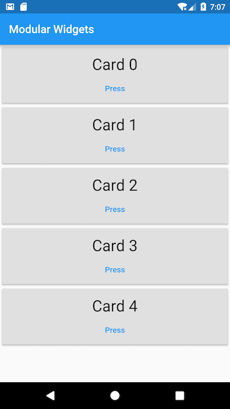

=== "iOS"

    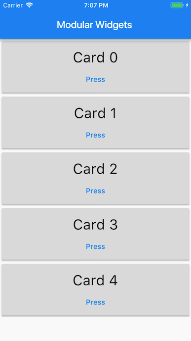

## Структура проекта и ресурсы

### С чего начать написание кода?

Начните с файла `lib/main.dart`. Он автоматически генерируется при создании приложения Flutter.

```dart title="Dart"
void main() {
  print('Hello, this is the main function.');
}
```

Во Flutter точкой входа является файл `{project_name}/lib/main.dart`, а выполнение начинается с функции `main`.

### Как структурированы файлы в приложении Flutter?

При создании нового проекта Flutter формирует следующую структуру каталогов. В дальнейшем ее можно изменить, но начинать следует именно с нее.

```
┬
└ project_name
  ┬
  ├ android      - Содержит файлы, специфичные для Android.
  ├ build        - Хранит файлы сборок для iOS и Android.
  ├ ios          - Содержит файлы, специфичные для iOS.
  ├ lib          - Содержит доступные извне исходные файлы Dart.
    ┬
    └ src        - Содержит дополнительные исходные файлы.
    └ main.dart  - Точка входа во Flutter и начало нового приложения.
                   Он генерируется автоматически при создании проекта Flutter проекта.
                   Именно с него начинается написание кода на языке Dart.
  ├ test         - Содержит файлы автоматизированного тестирования.
  └ pubspec.yaml - Содержит метаданные для приложения Flutter.
                   Это эквивалентно файлу package.json в React Native.
```

### Где я размещаю свои ресурсы и активы и как их использовать?

Ресурс или актив Flutter - это файл, который поставляется и развертывается вместе с вашим приложением и доступен во время выполнения. Приложения Flutter могут включать следующие типы активов:

-   Статические данные, такие как файлы JSON
-   файлы конфигурации
-   Значки и изображения (JPEG, PNG, GIF, анимированный GIF, WebP, анимированный WebP, BMP и WBMP).

Для определения активов, необходимых приложению, Flutter использует файл `pubspec.yaml`, расположенный в корне проекта.

```yaml
flutter:
    assets:
        - assets/my_icon.png
        - assets/background.png
```

В подразделе `assets` указываются файлы, которые должны быть включены в приложение. Каждый актив идентифицируется явным путем относительно файла `pubspec.yaml`, в котором находится файл актива. Порядок объявления активов не имеет значения. Не имеет значения и фактический используемый каталог (в данном случае `assets`). Однако, хотя активы могут быть размещены в любом каталоге приложения, лучше всего размещать их в каталоге `assets`.

Во время сборки Flutter помещает активы в специальный архив, называемый _asset bundle_, из которого приложения считывают их во время выполнения. Когда путь к активу указан в секции assets в файле `pubspec.yaml`, процесс сборки ищет все файлы с таким же именем в соседних подкаталогах. Эти файлы также включаются в пакет активов вместе с указанным активом. Flutter использует варианты активов при выборе подходящих по разрешению изображений для вашего приложения.

В React Native для добавления статического изображения необходимо поместить файл изображения в каталог с исходным кодом и сослаться на него.

```js title="Javascript"
<Image source={require('./my-icon.png')} />
// OR
<Image
  source={{
    url: 'https://reactnative.dev/img/tiny_logo.png'
  }}
/>
```

Во Flutter добавление статического изображения в приложение осуществляется с помощью конструктора `Image.asset` в методе сборки виджета.

```dart title="Dart"
Image.asset('assets/background.png');
```

Более подробную информацию см. [Adding Assets and Images in Flutter][].

### Как загружать изображения по сети?

В React Native необходимо указать `uri` в свойстве `source` компонента `Image`, а также указать размер, если это необходимо.

Во Flutter для включения изображения из URL используйте конструктор `Image.network`.

```dart title="Dart"
Image.network('https://docs.flutter.dev/assets/images/docs/owl.jpg');
```

### Как устанавливать пакеты и плагины пакетов?

Flutter поддерживает использование общих пакетов, предоставленных другими разработчиками экосистем Flutter и Dart. Это позволяет быстро создать приложение без необходимости разрабатывать все с нуля. Пакеты, содержащие код, специфичный для конкретной платформы, называются плагинами пакетов.

В React Native для установки пакетов из командной строки используется команда `yarn add {package-name}` или `npm install --save {package-name}`.

Во Flutter установка пакета выполняется по следующей инструкции:

1.  Чтобы добавить пакет `google_sign_in` в качестве зависимости, выполните команду `flutter pub add`:

    ```terminal
    $ flutter pub add google_sign_in
    ```

2.  Установите пакет из командной строки с помощью команды `flutter pub get`. Если вы используете IDE, она часто запускает `flutter pub get` за вас, или может предложить вам сделать это.
3.  Импортируйте пакет в код вашего приложения, как показано ниже:

    ```dart title="Dart"
    import 'package:flutter/material.dart';
    ```

Более подробная информация приведена в разделах [Using Packages][] и [Developing Packages & Plugins][].

Многие пакеты, совместно используемые разработчиками Flutter, можно найти в разделе [Flutter packages][] в [pub.dev][].

## Виджеты Flutter

Во Flutter пользовательский интерфейс строится из виджетов, которые описывают, как должно выглядеть их представление с учетом текущей конфигурации и состояния.

Виджеты часто состоят из множества небольших, одноцелевых виджетов, которые вложены друг в друга для получения мощных эффектов. Например, виджет `Container` состоит из нескольких виджетов, отвечающих за компоновку, рисование, позиционирование и размер. В частности, виджет `Container` включает в себя виджеты `LimitedBox`, `ConstrainedBox`, `Align`, `Padding`, `DecoratedBox` и `Transform`. Вместо того чтобы создавать подкласс `Container` для получения индивидуального эффекта, можно компоновать эти и другие простые виджеты новыми и уникальными способами.

Виджет `Center` - еще один пример того, как можно управлять расположением. Чтобы выровнять виджет по центру, оберните его виджетом `Center`, а затем используйте виджеты компоновки для выравнивания, строк, столбцов и сеток. Эти виджеты компоновки не имеют собственного визуального представления. Их единственное назначение - управление некоторыми аспектами компоновки другого виджета. Чтобы понять, почему виджет отображается определенным образом, часто бывает полезно просмотреть соседние виджеты.

Более подробную информацию можно найти в [Flutter Technical Overview][].

Для получения дополнительной информации о базовых виджетах из пакета `Widgets` смотрите [Flutter Basic Widgets][], [Flutter Widget Catalog][] или [Flutter Widget Index][].

## Views

### Что является эквивалентом контейнера `View`?

В React Native `View` - это контейнер, который поддерживает компоновку с помощью `Flexbox`, стиль, обработку касаний и элементы управления доступностью.

Во Flutter можно использовать основные виджеты компоновки из библиотеки `Widgets`, такие как [`Container`][], [`Column`][], [`Row`][] и [`Center`][]. Для получения дополнительной информации см. каталог [Layout Widgets][].

### Что является эквивалентом `FlatList` или `SectionList`?

Список `List` - это прокручиваемый список компонентов, расположенных вертикально.

В React Native для отображения простых или секционированных списков используются `FlatList` или `SectionList`.

```js title="Javascript"
// React Native
<FlatList
  data={[ ... ]}
  renderItem={({ item }) => <Text>{item.key}</Text>}
/>
```

[`ListView`][] - наиболее часто используемый во Flutter виджет прокрутки. Конструктор по умолчанию принимает явный список дочерних элементов. [`ListView`][] наиболее подходит для небольшого числа виджетов. Для большого или бесконечного списка используйте `ListView.builder`, который строит дочерние элементы по требованию и создает только те из них, которые видны.

```dart title="Dart"
var data = [
  'Hello',
  'World',
];
return ListView.builder(
  itemCount: data.length,
  itemBuilder: (context, index) {
    return Text(data[index]);
  },
);
```

=== "Android"

    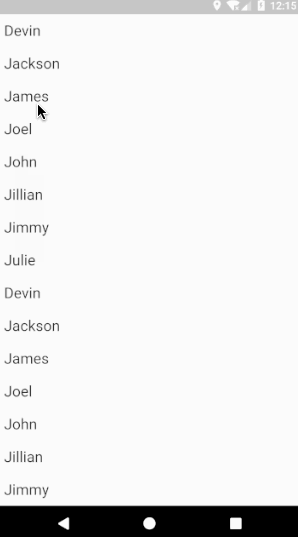

=== "iOS"

    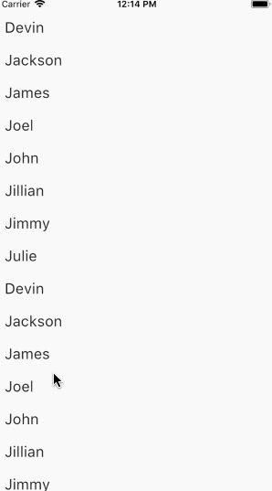

О том, как реализовать бесконечную прокрутку списка, можно узнать из официального примера [`infinite_list`][infinite_list].

### Как использовать Canvas для рисования или раскрашивания?

В React Native компоненты canvas отсутствуют, поэтому используются сторонние библиотеки типа `react-native-canvas`.

```js title="Javascript"
// React Native
const CanvasComp = () => {
    const handleCanvas = (canvas) => {
        const ctx = canvas.getContext('2d');
        ctx.fillStyle = 'skyblue';
        ctx.beginPath();
        ctx.arc(75, 75, 50, 0, 2 * Math.PI);
        ctx.fillRect(150, 100, 300, 300);
        ctx.stroke();
    };

    return (
        <View>
            <Canvas ref={this.handleCanvas} />
        </View>
    );
};
```

Во Flutter для рисования на холсте можно использовать классы [`CustomPaint`][] и [`CustomPainter`][].

В следующем примере показано, как рисовать на этапе закрашивания с помощью виджета `CustomPaint`. Он реализует абстрактный класс `CustomPainter` и передает его в свойство painter виджета `CustomPaint`. Подклассы `CustomPaint` должны реализовывать методы `paint()` и `shouldRepaint()`.

```dart title="Dart"
class MyCanvasPainter extends CustomPainter {
  const MyCanvasPainter();

  @override
  void paint(Canvas canvas, Size size) {
    final Paint paint = Paint()..color = Colors.amber;
    canvas.drawCircle(const Offset(100, 200), 40, paint);
    final Paint paintRect = Paint()..color = Colors.lightBlue;
    final Rect rect = Rect.fromPoints(
      const Offset(150, 300),
      const Offset(300, 400),
    );
    canvas.drawRect(rect, paintRect);
  }

  @override
  bool shouldRepaint(MyCanvasPainter oldDelegate) => false;
}

class MyCanvasWidget extends StatelessWidget {
  const MyCanvasWidget({super.key});

  @override
  Widget build(BuildContext context) {
    return const Scaffold(
      body: CustomPaint(painter: MyCanvasPainter()),
    );
  }
}
```

=== "Android"

    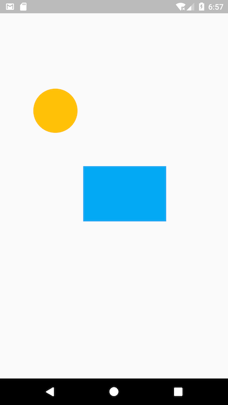

=== "iOS"

    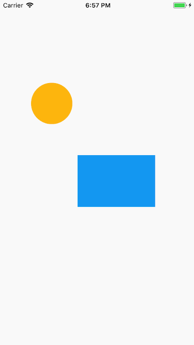

## Макеты

### Как использовать виджеты для определения свойств макета?

В React Native большая часть компоновки может быть выполнена с помощью реквизитов, которые передаются конкретному компоненту. Например, можно использовать реквизит `style` для компонента `View`, чтобы задать свойства flexbox. Чтобы расположить компоненты в столбец, можно указать такой реквизит, как: `flexDirection: 'column'`.

```js title="Javascript"
// React Native
<View
  style={{
    flex: 1,
    flexDirection: 'column',
    justifyContent: 'space-between',
    alignItems: 'center'
  }}
>
```

Во Flutter компоновка определяется в основном виджетами, специально предназначенными для компоновки, в сочетании с виджетами управления и их стилевыми свойствами.

Например, виджеты [`Column`][] и [`Row`][] принимают массив дочерних элементов и выравнивают их по вертикали и горизонтали соответственно. Виджет [`Container`][] принимает комбинацию свойств макета и стиля, а виджет [`Center`][] центрирует свои дочерние виджеты.

```dart title="Dart"
@override
Widget build(BuildContext context) {
  return Center(
    child: Column(
      children: <Widget>[
        Container(
          color: Colors.red,
          width: 100,
          height: 100,
        ),
        Container(
          color: Colors.blue,
          width: 100,
          height: 100,
        ),
        Container(
          color: Colors.green,
          width: 100,
          height: 100,
        ),
      ],
    ),
  );
```

Flutter предоставляет множество виджетов компоновки в своей основной библиотеке виджетов. Например, [`Padding`][], [`Align`][] и [`Stack`][].

Полный список приведен в разделе [Layout Widgets][].

=== "Android"

    

=== "iOS"

    

### Как накладывать слои на виджеты?

В React Native компоненты можно располагать слоями, используя `absolute` позиционирование.

Flutter использует виджет [`Stack`][] для расположения дочерних виджетов слоями. Виджеты могут полностью или частично перекрывать базовый виджет.

Виджет `Stack` позиционирует свои дочерние виджеты относительно краев своего поля. Этот класс полезен, если необходимо просто наложить несколько дочерних виджетов друг на друга.

```dart title="Dart"
@override
Widget build(BuildContext context) {
  return Stack(
    alignment: const Alignment(0.6, 0.6),
    children: <Widget>[
      const CircleAvatar(
        backgroundImage: NetworkImage(
          'https://avatars3.githubusercontent.com/u/14101776?v=4',
        ),
      ),
      Container(
        color: Colors.black45,
        child: const Text('Flutter'),
      ),
    ],
  );
```

В предыдущем примере `Stack` используется для наложения контейнера (который отображает свой `Text` на полупрозрачном черном фоне) поверх `CircleAvatar`. Стек смещает текст с помощью свойства выравнивания и координат `Alignment`.

=== "Android"

    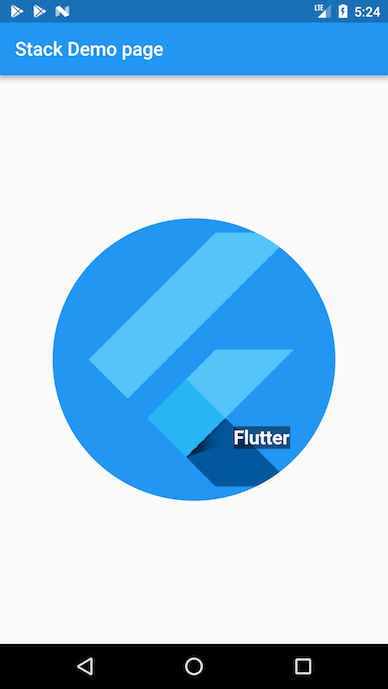

=== "iOS"

    

Для получения дополнительной информации см. документацию по классу [`Stack`][].

## Стилизация

### Как стилизовать компоненты?

В React Native для стилизации компонентов используются встроенная стилизация и `stylesheets.create`.

```js title="Javascript"
// React Native
<View style={styles.container}>
  <Text style={{ fontSize: 32, color: 'cyan', fontWeight: '600' }}>
    This is a sample text
  </Text>
</View>

const styles = StyleSheet.create({
  container: {
    flex: 1,
    backgroundColor: '#fff',
    alignItems: 'center',
    justifyContent: 'center'
  }
});
```

Во Flutter виджет `Text` может принимать класс `TextStyle` для своего свойства style. Если вы хотите использовать один и тот же стиль текста в нескольких местах, вы можете создать класс [`TextStyle`][] и использовать его для нескольких виджетов `Text`.

```dart title="Dart"
const TextStyle textStyle = TextStyle(
  color: Colors.cyan,
  fontSize: 32,
  fontWeight: FontWeight.w600,
);

return const Center(
  child: Column(
    children: <Widget>[
      Text('Sample text', style: textStyle),
      Padding(
        padding: EdgeInsets.all(20),
        child: Icon(
          Icons.lightbulb_outline,
          size: 48,
          color: Colors.redAccent,
        ),
      ),
    ],
  ),
);
```

=== "Android"

    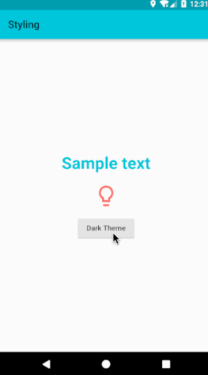

=== "iOS"

    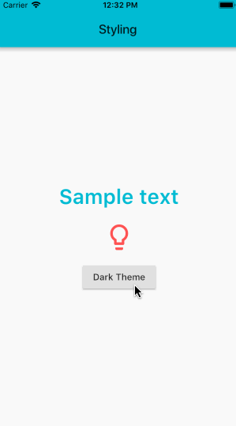

### Как использовать `Icons` и `Colors`?

В React Native нет поддержки иконок, поэтому используются сторонние библиотеки.

Во Flutter импорт библиотеки Material также позволяет получить богатый набор [Material icons][] и [colors][].

```dart title="Dart"
return const Icon(Icons.lightbulb_outline, color: Colors.redAccent);
```

При использовании класса `Icons` обязательно установите значение `uses-material-design: true` в файле проекта `pubspec.yaml`. Это гарантирует, что шрифт `MaterialIcons`, отображающий иконки, будет включен в ваше приложение. В общем случае, если вы собираетесь использовать библиотеку Material, вам следует включить эту строку.

```yaml
name: my_awesome_application
flutter:
    uses-material-design: true
```

Пакет Flutter [Cupertino (iOS-style)][] обеспечивает высокую точность виджетов для текущего языка дизайна iOS. Чтобы использовать шрифт `CupertinoIcons`, добавьте зависимость для `cupertino_icons` в файл `pubspec.yaml` вашего проекта.

```yaml
name: my_awesome_application
dependencies:
    cupertino_icons: ^0.1.0
```

Чтобы глобально настроить цвета и стили компонентов, используйте `ThemeData` для задания цветов по умолчанию для различных аспектов темы. Установите свойство theme в `MaterialApp` на объект `ThemeData`. Класс [`Colors`][] предоставляет цвета из [color palette][] Material Design.

В следующем примере для основного образца устанавливается `blue`, а для выделения текста - `red`.

```dart title="Dart"
class SampleApp extends StatelessWidget {
  const SampleApp({super.key});

  @override
  Widget build(BuildContext context) {
    return MaterialApp(
      title: 'Sample App',
      theme: ThemeData(
          primarySwatch: Colors.blue,
          textSelectionTheme:
              const TextSelectionThemeData(selectionColor: Colors.red)),
      home: const SampleAppPage(),
    );
  }
}
```

### Как добавить темы стилей?

В React Native общие темы задаются для компонентов в таблицах стилей и затем используются в компонентах.

Во Flutter можно создать единый стиль практически для всего, определив стиль в классе [`ThemeData`][] и передав его в свойство theme в виджете [`MaterialApp`][].

```dart title="Dart"
@override
Widget build(BuildContext context) {
  return MaterialApp(
    theme: ThemeData(
      primaryColor: Colors.cyan,
      brightness: Brightness.dark,
    ),
    home: const StylingPage(),
  );
}
```

Применять `Theme` можно даже без использования виджета `MaterialApp`. Виджет [`Theme`][] принимает `ThemeData` в параметре `data` и применяет `ThemeData` ко всем своим дочерним виджетам.

```dart title="Dart"
@override
Widget build(BuildContext context) {
  return Theme(
    data: ThemeData(
      primaryColor: Colors.cyan,
      brightness: brightness,
    ),
    child: Scaffold(
      backgroundColor: Theme.of(context).primaryColor,
      //...
    ),
  );
}
```

## Управление состоянием

Состояние - это информация, которая может быть прочитана синхронно при создании виджета, или информация, которая может измениться в течение времени жизни виджета. Для управления состоянием приложения во Flutter используется [`StatefulWidget`][] в паре с объектом State.

Более подробную информацию о способах управления состоянием во Flutter можно найти в разделе [State management][].

### StatelessWidget

Виджет `StatelessWidget` во Flutter - это виджет, который не требует изменения состояния &mdash; у него нет внутреннего состояния, которым можно управлять.

Виджеты без состояния полезны, когда описываемая часть пользовательского интерфейса не зависит ни от чего, кроме конфигурационной информации самого объекта и [`BuildContext`][], в котором раздувается виджет.

[AboutDialog][], [`CircleAvatar`][] и [`Text`][] являются примерами виджетов без статусов, подклассом которых является [`StatelessWidget`][].

```dart title="Dart"
import 'package:flutter/material.dart';

void main() => runApp(
      const MyStatelessWidget(
        text: 'StatelessWidget Example to show immutable data',
      ),
    );

class MyStatelessWidget extends StatelessWidget {
  const MyStatelessWidget({
    super.key,
    required this.text,
  });

  final String text;

  @override
  Widget build(BuildContext context) {
    return Center(
      child: Text(
        text,
        textDirection: TextDirection.ltr,
      ),
    );
  }
}
```

В предыдущем примере конструктор класса `MyStatelessWidget` использует для передачи `text`, который помечен как `final`. Этот класс расширяет класс `StatelessWidget` &mdash; он содержит неизменяемые данные.

Метод `build` виджета stateless обычно вызывается только в трех ситуациях:

-   При вставке виджета в дерево
-   Когда родитель виджета изменяет свою конфигурацию
-   когда изменяется [`InheritedWidget`][], от которого он зависит.

### StatefulWidget

Виджет [`StatefulWidget`][] - это виджет, который изменяет состояние. Для управления изменением состояния виджета `StatefulWidget` используйте метод `setState`. Вызов `setState()` сообщает фреймворку Flutter, что в состоянии что-то изменилось, что заставляет приложение повторно выполнить метод `build()`, чтобы отразить изменения.

_State_ - это информация, которая может быть прочитана синхронно при сборке виджета и может измениться в течение его жизни. Реализатор виджета обязан обеспечить своевременное уведомление объекта state об изменении состояния. Используйте `StatefulWidget`, если состояние виджета может изменяться динамически. Например, состояние виджета изменяется при вводе текста в форму или перемещении ползунка. Или оно может меняться с течением времени - например, при обновлении данных в пользовательском интерфейсе.

[`Checkbox`][], [`Radio`][], [`Slider`][], [`InkWell`][], [`Form`][] и [`TextField`][] - это примеры виджетов с состоянием, которые являются подклассами [`StatefulWidget`][].

В следующем примере объявлен виджет `StatefulWidget`, для которого требуется метод `createState()`. Этот метод создает объект состояния, управляющий состоянием виджета, `_MyStatefulWidgetState`.

```dart title="Dart"
class MyStatefulWidget extends StatefulWidget {
  const MyStatefulWidget({
    super.key,
    required this.title,
  });

  final String title;

  @override
  State<MyStatefulWidget> createState() => _MyStatefulWidgetState();
}
```

Следующий класс состояния, `_MyStatefulWidgetState`, реализует метод `build()` для виджета. При изменении состояния, например, при переключении пользователем кнопки, вызывается `setState()` с новым значением toggle. Это заставляет фреймворк перестроить данный виджет в пользовательском интерфейсе.

```dart title="Dart"
class _MyStatefulWidgetState extends State<MyStatefulWidget> {
  bool showText = true;
  bool toggleState = true;
  Timer? t2;

  void toggleBlinkState() {
    setState(() {
      toggleState = !toggleState;
    });
    if (!toggleState) {
      t2 = Timer.periodic(const Duration(milliseconds: 1000), (t) {
        toggleShowText();
      });
    } else {
      t2?.cancel();
    }
  }

  void toggleShowText() {
    setState(() {
      showText = !showText;
    });
  }

  @override
  Widget build(BuildContext context) {
    return Scaffold(
      body: Center(
        child: Column(
          children: <Widget>[
            if (showText)
              const Text(
                'This execution will be done before you can blink.',
              ),
            Padding(
              padding: const EdgeInsets.only(top: 70),
              child: ElevatedButton(
                onPressed: toggleBlinkState,
                child: toggleState
                    ? const Text('Blink')
                    : const Text('Stop Blinking'),
              ),
            ),
          ],
        ),
      ),
    );
  }
}
```

### Каковы лучшие практики использования StatefulWidget и StatelessWidget?

Вот несколько моментов, которые следует учитывать при проектировании виджета.

1.  Определите, должен ли виджет быть `StatefulWidget` или `StatelessWidget`.

    Во Flutter виджеты являются либо Stateful, либо Stateless - в зависимости от того, зависят ли они от изменения состояния.

    -   Если виджет изменяется &mdash; пользователь взаимодействует с ним или поток данных прерывает работу пользовательского интерфейса, то он является _Stateful_.

    -   Если виджет конечный или неизменяемый, то он _Stateless_.

2.  Определите, какой объект управляет состоянием виджета (для `StatefulWidget`).

    Во Flutter существует три основных способа управления состоянием:

    -   Виджет управляет своим собственным состоянием
    -   Родительский виджет управляет состоянием виджета
    -   Комбинированный подход

    Решая, какой подход использовать, учитывайте следующие принципы:

    -   Если состояние - это пользовательские данные, например, установленный или снятый флажок или положение ползунка, то лучше всего управлять состоянием родительского виджета.
    -   Если рассматриваемое состояние является эстетическим, например анимация, то лучше всего управлять этим состоянием самому виджету.
    -   Если есть сомнения, пусть родительский виджет управляет состоянием дочернего виджета.

3.  Подкласс StatefulWidget и State.

    Класс `MyStatefulWidget` управляет собственным состоянием &mdash; он расширяет `StatefulWidget`, переопределяет метод `createState()` для создания объекта `State`, а фреймворк вызывает `createState()` для создания виджета. В данном примере `createState()` создает экземпляр `_MyStatefulWidgetState`, который реализуется в следующей лучшей практике.

    ```dart title="Dart"
    class MyStatefulWidget extends StatefulWidget {
    	const MyStatefulWidget({
    		super.key,
    		required this.title,
    	});

    	final String title;
    	@override
    	State<MyStatefulWidget> createState() => _MyStatefulWidgetState();
    }

    class _MyStatefulWidgetState extends State<MyStatefulWidget> {
    	@override
    	Widget build(BuildContext context) {
    		//...
    	}
    }
    ```

4.  Добавьте StatefulWidget в дерево виджетов.

    Добавьте свой собственный `StatefulWidget` в дерево виджетов в методе сборки приложения.

    ```dart title="Dart"
    class MyStatelessWidget extends StatelessWidget {
    	// This widget is the root of your application.
    	const MyStatelessWidget({super.key});

    	@override
    	Widget build(BuildContext context) {
    		return const MaterialApp(
    		title: 'Flutter Demo',
    		home: MyStatefulWidget(title: 'State Change Demo'),
    		);
    	}
    }
    ```

=== "Android"

    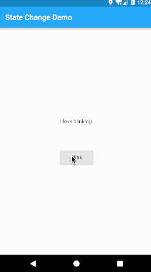

=== "iOS"

    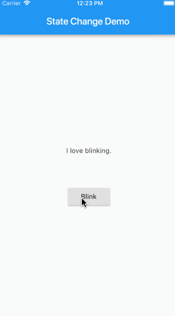

## Props

В React Native большинство компонентов можно настраивать при их создании с помощью различных параметров или свойств, называемых `props`. Эти параметры могут быть использованы в дочернем компоненте с помощью `this.props`.

```js title="Javascript"
// React Native
const CustomCard = ({ index, onPress }) => {
    return (
        <View>
            <Text> Card {index} </Text>
            <Button
                title="Press"
                onPress={() => onPress(index)}
            />
        </View>
    );
};

const App = () => {
    const onPress = (index) => {
        console.log('Card ', index);
    };

    return (
        <View>
            <FlatList
                data={
                    [
                        /* ... */
                    ]
                }
                renderItem={({ item }) => (
                    <CustomCard
                        onPress={onPress}
                        index={item.key}
                    />
                )}
            />
        </View>
    );
};
```

Во Flutter свойству, полученному в параметризованном конструкторе, присваивается локальная переменная или функция с пометкой `final`.

```dart title="Dart"
/// Flutter
class CustomCard extends StatelessWidget {
  const CustomCard({
    super.key,
    required this.index,
    required this.onPress,
  });

  final int index;
  final void Function() onPress;

  @override
  Widget build(BuildContext context) {
    return Card(
        child: Column(
      children: <Widget>[
        Text('Card $index'),
        TextButton(
          onPressed: onPress,
          child: const Text('Press'),
        ),
      ],
    ));
  }
}

class UseCard extends StatelessWidget {
  const UseCard({super.key, required this.index});

  final int index;

  @override
  Widget build(BuildContext context) {
    /// Usage
    return CustomCard(
      index: index,
      onPress: () {
        print('Card $index');
      },
    );
  }
}
```

=== "Android"

    

=== "iOS"

    

## Локальное хранилище

Если вам не нужно хранить много данных, и они не требуют структурирования, вы можете использовать `shared_preferences`, которая позволяет читать и записывать постоянные пары ключ-значение примитивных типов данных: booleans, floats, ints, longs и strings.

### Как хранить постоянные пары ключ-значение, которые являются глобальными для приложения?

В React Native для хранения и извлечения данных, которые являются постоянными и глобальными для приложения, используются функции `setItem` и `getItem` компонента `AsyncStorage`.

```js title="Javascript"
// React Native
const [counter, setCounter] = useState(0);
// ...
await AsyncStorage.setItem(
    'counterkey',
    json.stringify(++this.state.counter)
);
AsyncStorage.getItem('counterkey').then((value) => {
    if (value != null) {
        setCounter(value);
    }
});
```

Во Flutter для хранения и получения данных с ключевыми значениями, которые являются постоянными и глобальными для приложения, используется плагин [`shared_preferences`][]. Плагин `shared_preferences` оборачивает `NSUserDefaults` на iOS и `SharedPreferences` на Android, обеспечивая постоянное хранение простых данных.

Чтобы добавить пакет `shared_preferences` в качестве зависимости, выполните команду `flutter pub add`:

```terminal
$ flutter pub add shared_preferences
```

```dart title="Dart"
import 'package:shared_preferences/shared_preferences.dart';
```

Для реализации постоянных данных следует использовать методы-установщики, предоставляемые классом `SharedPreferences`. Методы setter доступны для различных примитивных типов, таких как `setInt`, `setBool` и `setString`. Для чтения данных используется соответствующий метод getter, предоставляемый классом `SharedPreferences`. Для каждого сеттера существует соответствующий метод геттера, например, `getInt`, `getBool` и `getString`.

```dart title="Dart"
Future<void> updateCounter() async {
  final prefs = await SharedPreferences.getInstance();
  int? counter = prefs.getInt('counter');
  if (counter is int) {
    await prefs.setInt('counter', ++counter);
  }
  setState(() {
    _counter = counter;
  });
}
```

## Маршрутизация

Большинство приложений содержит несколько экранов для отображения различных типов информации. Например, у вас может быть экран продукта, на котором отображаются изображения, где пользователи могут нажать на изображение продукта, чтобы получить более подробную информацию о нем на новом экране.

В Android новые экраны - это новые Activities. В iOS новые экраны - это новые ViewControllers. Во Flutter экраны - это просто виджеты! А для перехода к новым экранам во Flutter используется виджет Navigator.

### Как мне перемещаться между экранами?

В React Native есть три основных навигатора: StackNavigator, TabNavigator и DrawerNavigator. Каждый из них предоставляет возможность конфигурирования и определения экранов.

```js title="Javascript"
// React Native
const MyApp = TabNavigator(
    {
        Home: { screen: HomeScreen },
        Notifications: { screen: tabNavScreen },
    },
    { tabBarOptions: { activeTintColor: '#e91e63' } }
);
const SimpleApp = StackNavigator({
    Home: { screen: MyApp },
    stackScreen: { screen: StackScreen },
});
export default MyApp1 = DrawerNavigator({
    Home: {
        screen: SimpleApp,
    },
    Screen2: {
        screen: drawerScreen,
    },
});
```

Во Flutter существует два основных виджета, используемых для навигации между экранами:

-   [`Route`][] - это абстракция для экрана или страницы приложения.
-   Виджет [`Navigator`][] - это виджет, который управляет маршрутами.

Виджет `Navigator` определяется как виджет, управляющий набором дочерних виджетов с дисциплиной стека. Навигатор управляет стеком объектов `Route` и предоставляет методы для управления стеком, такие как [`Navigator.push`][] и [`Navigator.pop`][]. Список маршрутов может быть задан в виджете [`MaterialApp`][], или они могут быть построены "на лету", например, в анимации героя. В следующем примере именованные маршруты задаются в виджете `MaterialApp`.

!!!alert ""

    Именованные маршруты больше не рекомендуются для большинства приложений. Дополнительную информацию см. в разделе [Limitations][] на странице [navigation overview][].

    [limitations]: https://docs.flutter.dev/ui/navigation#limitations
    [navigation overview]: https://docs.flutter.dev/ui/navigation

```dart title="Dart"
class NavigationApp extends StatelessWidget {
  // This widget is the root of your application.
  const NavigationApp({super.key});

  @override
  Widget build(BuildContext context) {
    return MaterialApp(
      //...
      routes: <String, WidgetBuilder>{
        '/a': (context) => const UsualNavScreen(),
        '/b': (context) => const DrawerNavScreen(),
      },
      //...
    );
  }
}
```

Для перехода к именованному маршруту используется метод [`Navigator.of()`][], в котором указывается `BuildContext` (дескриптор расположения виджета в дереве виджетов). Имя маршрута передается в функцию `pushNamed` для перехода к указанному маршруту.

```dart title="Dart"
Navigator.of(context).pushNamed('/a');
```

Можно также использовать метод push функции `Navigator`, который добавляет заданный [`Route`][] в историю навигатора, наиболее плотно охватывающего заданный [`BuildContext`][], и осуществляет переход к нему. В следующем примере виджет [`MaterialPageRoute`][] представляет собой модальный маршрут, который заменяет весь экран с помощью адаптивного к платформе перехода. В качестве обязательного параметра он принимает [`WidgetBuilder`][].

```dart title="Dart"
Navigator.push(
  context,
  MaterialPageRoute(
    builder: (context) => const UsualNavScreen(),
  ),
);
```

### Как использовать навигацию по вкладкам и по ящикам?

В приложениях Material Design есть два основных варианта навигации Flutter: вкладки и ящики. Когда места для вкладок недостаточно, хорошей альтернативой являются ящики.

#### Навигация по вкладкам

В React Native для отображения вкладок и навигации по вкладкам используются функции `createBottomTabNavigator` и `TabNavigation`.

```js title="Javascript"
// React Native
import { createBottomTabNavigator } from 'react-navigation';

const MyApp = TabNavigator(
    {
        Home: { screen: HomeScreen },
        Notifications: { screen: tabNavScreen },
    },
    { tabBarOptions: { activeTintColor: '#e91e63' } }
);
```

Flutter предоставляет несколько специализированных виджетов для навигации по ящикам и вкладкам:

[`TabController`][]
: Координирует выбор вкладок между `TabBar` и `TabBarView` и `TabBarView`.

[`TabBar`][]
: Отображает горизонтальный ряд вкладок.

[`Tab`][]
: Создает вкладку `TabBar` с материальным дизайном.

[`TabBarView`][]
: Отображает виджет, соответствующий текущей выбранной вкладке.

```dart title="Dart"
class _MyAppState extends State<MyApp> with SingleTickerProviderStateMixin {
  late TabController controller = TabController(length: 2, vsync: this);

  @override
  Widget build(BuildContext context) {
    return TabBar(
      controller: controller,
      tabs: const <Tab>[
        Tab(icon: Icon(Icons.person)),
        Tab(icon: Icon(Icons.email)),
      ],
    );
  }
}
```

Контроллер `TabController` необходим для координации выбора вкладок между `TabBar` и `TabBarView`. Аргумент `length` конструктора `TabController` - это общее количество вкладок. Для запуска уведомления при изменении состояния кадра требуется `TickerProvider`. В качестве `TickerProvider` выступает `vsync`. Передавайте аргумент `vsync: this` конструктору `TabController` каждый раз, когда создаете новый `TabController`.

[`TickerProvider`][] - это интерфейс, реализуемый классами, которые могут продавать объекты [`Ticker`][]. Тикеры могут использоваться любым объектом, который должен получать уведомления о срабатывании кадра, но чаще всего они используются опосредованно через [`AnimationController`][]. Для получения своего `Ticker` контроллеру анимации необходим `TickerProvider`. Если вы создаете AnimationController из состояния, то для получения подходящего `TickerProvider` можно использовать классы [`TickerProviderStateMixin`][] или [`SingleTickerProviderStateMixin`][].

Виджет [`Scaffold`][] оборачивает новый виджет `TabBar` и создает две вкладки. Виджет `TabBarView` передается в качестве параметра `body` виджета `Scaffold`. Все экраны, соответствующие вкладкам виджета `TabBar`, являются дочерними для виджета `TabBarView` вместе с тем же `TabController`.

```dart title="Dart"
class _NavigationHomePageState extends State<NavigationHomePage>
    with SingleTickerProviderStateMixin {
  late TabController controller = TabController(length: 2, vsync: this);

  @override
  Widget build(BuildContext context) {
    return Scaffold(
        bottomNavigationBar: Material(
          color: Colors.blue,
          child: TabBar(
            tabs: const <Tab>[
              Tab(
                icon: Icon(Icons.person),
              ),
              Tab(
                icon: Icon(Icons.email),
              ),
            ],
            controller: controller,
          ),
        ),
        body: TabBarView(
          controller: controller,
          children: const <Widget>[HomeScreen(), TabScreen()],
        ));
  }
}
```

#### Drawer navigation

В React Native импортируйте необходимые пакеты react-navigation, а затем используйте `createDrawerNavigator` и `DrawerNavigation`.

```js title="Javascript"
// React Native
export default MyApp1 = DrawerNavigator({
    Home: {
        screen: SimpleApp,
    },
    Screen2: {
        screen: drawerScreen,
    },
});
```

Во Flutter мы можем использовать виджет `Drawer` в сочетании с `Scaffold` для создания макета с ящиком Material Design. Чтобы добавить виджет `Drawer` в приложение, оберните его виджетом `Scaffold`. Виджет `Scaffold` обеспечивает согласованную визуальную структуру приложений, которые следуют рекомендациям [Material Design][]. Он также поддерживает специальные компоненты Material Design, такие как `Drawers`, `AppBars` и `SnackBars`.

Виджет `Drawer` - это панель Material Design, которая выдвигается горизонтально от края `Scaffold` для отображения навигационных ссылок в приложении. В качестве дочернего виджета `Drawer` можно предоставить [`ElevatedButton`][], виджет [`Text`][] или список элементов для отображения. В следующем примере виджет [`ListTile`][] обеспечивает навигацию при касании.

```dart title="Dart"
@override
Widget build(BuildContext context) {
  return Drawer(
    elevation: 20,
    child: ListTile(
      leading: const Icon(Icons.change_history),
      title: const Text('Screen2'),
      onTap: () {
        Navigator.of(context).pushNamed('/b');
      },
    ),
  );
}
```

Виджет `Scaffold` также включает в себя виджет `AppBar`, который автоматически отображает соответствующую кнопку IconButton для показа `Drawer`, когда Drawer доступен в `Scaffold`. Виджет `Scaffold` автоматически обрабатывает жест пролистывания края, чтобы показать `Drawer`.

```dart title="Dart"
@override
Widget build(BuildContext context) {
  return Scaffold(
    drawer: Drawer(
      elevation: 20,
      child: ListTile(
        leading: const Icon(Icons.change_history),
        title: const Text('Screen2'),
        onTap: () {
          Navigator.of(context).pushNamed('/b');
        },
      ),
    ),
    appBar: AppBar(title: const Text('Home')),
    body: Container(),
  );
}
```

=== "Android"

    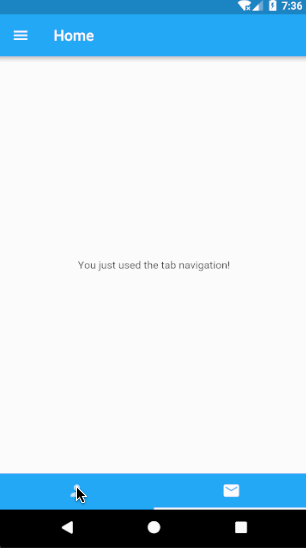

=== "iOS"

    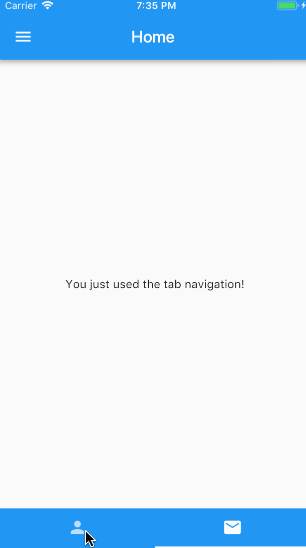

## Обнаружение жестов и обработка событий касания

Для обнаружения жестов и реагирования на них Flutter поддерживает касания, перетаскивания и масштабирование. Система жестов во Flutter состоит из двух отдельных уровней. Первый слой включает необработанные события указателей, которые описывают расположение и перемещение указателей (например, прикосновения, движения мыши или стилуса) по экрану. Второй слой включает жесты, которые описывают семантические действия, состоящие из одного или нескольких движений указателя.

### Как добавить в виджет слушателей нажатия или щелчка?

В React Native слушатели добавляются к компонентам с помощью `PanResponder` или компонентов `Touchable`.

```js title="Javascript"
// React Native
<TouchableOpacity
    onPress={() => {
        console.log('Press');
    }}
    onLongPress={() => {
        console.log('Long Press');
    }}
>
    <Text>Tap or Long Press</Text>
</TouchableOpacity>
```

Для более сложных жестов и объединения нескольких касаний в один жест используется [`PanResponder`][].

```js title="Javascript"
// React Native
const App = () => {
    const panResponderRef = useRef(null);

    useEffect(() => {
        panResponderRef.current = PanResponder.create({
            onMoveShouldSetPanResponder: (
                event,
                gestureState
            ) => !!getDirection(gestureState),
            onPanResponderMove: (event, gestureState) =>
                true,
            onPanResponderRelease: (
                event,
                gestureState
            ) => {
                const drag = getDirection(gestureState);
            },
            onPanResponderTerminationRequest: (
                event,
                gestureState
            ) => true,
        });
    }, []);

    return (
        <View
            style={styles.container}
            {...panResponderRef.current.panHandlers}
        >
            <View style={styles.center}>
                <Text>
                    Swipe Horizontally or Vertically
                </Text>
            </View>
        </View>
    );
};
```

Во Flutter для добавления слушателя щелчков (или нажатий) в виджет используйте кнопку или сенсорный виджет, имеющий `onPress: field`. Или добавьте обнаружение жестов к любому виджету, обернув его в [`GestureDetector`][].

```dart title="Dart"
@override
Widget build(BuildContext context) {
  return GestureDetector(
    child: Scaffold(
      appBar: AppBar(title: const Text('Gestures')),
      body: const Center(
          child: Column(
        mainAxisAlignment: MainAxisAlignment.center,
        children: <Widget>[
          Text('Tap, Long Press, Swipe Horizontally or Vertically'),
        ],
      )),
    ),
    onTap: () {
      print('Tapped');
    },
    onLongPress: () {
      print('Long Pressed');
    },
    onVerticalDragEnd: (value) {
      print('Swiped Vertically');
    },
    onHorizontalDragEnd: (value) {
      print('Swiped Horizontally');
    },
  );
}
```

Более подробную информацию, включая список обратных вызовов Flutter `GestureDetector`, можно найти в разделе [GestureDetector class][].

[gesturedetector class]: https://api.flutter.dev/flutter/widgets/GestureDetector-class.html#instance-properties

=== "Android"

    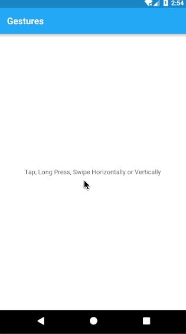

=== "iOS"

    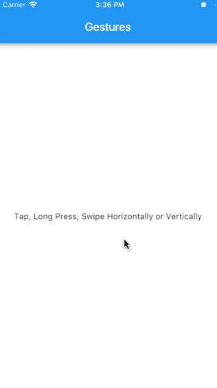

## Выполнение сетевых запросов HTTP

Получение данных из Интернета является обычным делом для большинства приложений. И во Flutter пакет `http` предоставляет самый простой способ получения данных из Интернета.

### Как получить данные из вызовов API?

React Native предоставляет Fetch API для работы с сетью - вы делаете fetch-запрос, а затем получаете ответ, чтобы получить данные.

```js title="Javascript"
// React Native
const [ipAddress, setIpAddress] = useState('');

const _getIPAddress = () => {
    fetch('https://httpbin.org/ip')
        .then((response) => response.json())
        .then((responseJson) => {
            setIpAddress(responseJson.origin);
        })
        .catch((error) => {
            console.error(error);
        });
};
```

Flutter использует пакет `http`.

Чтобы добавить пакет `http` в качестве зависимости, выполните команду `flutter pub add`:

```terminal
$ flutter pub add http
```

Flutter использует клиент поддержки HTTP [`dart:io`][] ядра. Чтобы создать HTTP-клиент, импортируйте `dart:io`.

```dart title="Dart"
import 'dart:io';
```

Клиент поддерживает следующие операции HTTP: GET, POST, PUT и DELETE.

```dart title="Dart"
final url = Uri.parse('https://httpbin.org/ip');
final httpClient = HttpClient();

Future<void> getIPAddress() async {
  final request = await httpClient.getUrl(url);
  final response = await request.close();
  final responseBody = await response.transform(utf8.decoder).join();
  final String ip = jsonDecode(responseBody)['origin'];
  setState(() {
    _ipAddress = ip;
  });
}
```

=== "Android"

    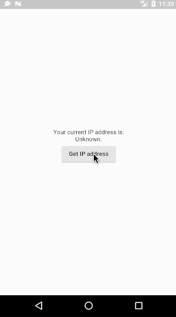

=== "iOS"

    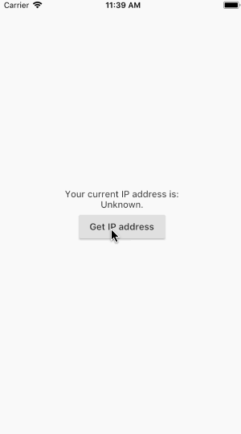

## Ввод формы

Текстовые поля позволяют пользователям вводить текст в ваше приложение, поэтому их можно использовать для создания форм, приложений для обмена сообщениями, поиска и т.д. Flutter предоставляет два основных виджета текстовых полей: [`TextField`][] и [`TextFormField`][].

### Как использовать виджеты текстовых полей?

В React Native для ввода текста используется компонент `TextInput`, который отображает поле ввода текста, а затем с помощью обратного вызова сохраняет значение в переменной.

```js title="Javascript"
// React Native
const [password, setPassword] = useState('')
...
<TextInput
  placeholder="Enter your Password"
  onChangeText={password => setPassword(password)}
/>
<Button title="Submit" onPress={this.validate} />
```

Во Flutter для управления виджетом `TextField` используется класс [`TextEditingController`][]. При каждом изменении текстового поля контроллер уведомляет своих слушателей.

Слушатели считывают свойства text и selection, чтобы узнать, что пользователь ввел в поле. Доступ к тексту в `TextField` можно получить через свойство `text` контроллера.

```dart title="Dart"
final TextEditingController _controller = TextEditingController();

@override
Widget build(BuildContext context) {
  return Column(children: [
    TextField(
      controller: _controller,
      decoration: const InputDecoration(
        hintText: 'Type something',
        labelText: 'Text Field',
      ),
    ),
    ElevatedButton(
      child: const Text('Submit'),
      onPressed: () {
        showDialog(
            context: context,
            builder: (context) {
              return AlertDialog(
                title: const Text('Alert'),
                content: Text('You typed ${_controller.text}'),
              );
            });
      },
    ),
  ]);
}
```

В данном примере при нажатии пользователем кнопки submit диалог оповещения отображает текущий текст, введенный в текстовое поле. Для этого используется виджет [`AlertDialog`][], который выводит сообщение о предупреждении, а доступ к тексту из `TextField` осуществляется через свойство `text` контроллера [`TextEditingController`][].

### Как использовать виджеты формы?

Во Flutter используется виджет [`Form`][], в котором в качестве дочерних передаются виджеты [`TextFormField`][] и кнопка submit. Виджет `TextFormField` имеет параметр [`onSaved`][], который принимает обратный вызов и выполняется при сохранении формы. Объект `FormState` используется для сохранения, сброса или проверки каждого `FormField`, являющегося потомком данной `Form`. Для получения `FormState` можно использовать `Form.of()` с контекстом, предком которого является `Form`, или передать конструктору `Form` `GlobalKey` и вызвать `GlobalKey.currentState()`.

```dart title="Dart"
@override
Widget build(BuildContext context) {
  return Form(
    key: formKey,
    child: Column(
      children: <Widget>[
        TextFormField(
          validator: (value) {
            if (value != null && value.contains('@')) {
              return null;
            }
            return 'Not a valid email.';
          },
          onSaved: (val) {
            _email = val;
          },
          decoration: const InputDecoration(
            hintText: 'Enter your email',
            labelText: 'Email',
          ),
        ),
        ElevatedButton(
          onPressed: _submit,
          child: const Text('Login'),
        ),
      ],
    ),
  );
}
```

В следующем примере показано, как `Form.save()` и `formKey` (который является `GlobalKey`) используются для сохранения формы при отправке.

```dart title="Dart"
void _submit() {
  final form = formKey.currentState;
  if (form != null && form.validate()) {
    form.save();
    showDialog(
      context: context,
      builder: (context) {
        return AlertDialog(
            title: const Text('Alert'),
            content: Text('Email: $_email, password: $_password'));
      },
    );
  }
}
```

=== "Android"

    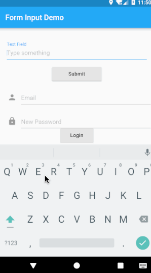

=== "iOS"

    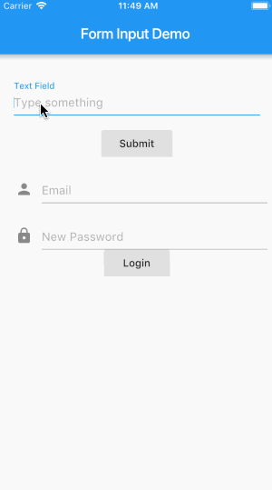

## Код для конкретной платформы

При создании кроссплатформенного приложения необходимо использовать как можно больше кода для разных платформ. Однако могут возникнуть ситуации, когда в зависимости от ОС код должен быть разным. Это требует отдельной реализации с объявлением конкретной платформы.

В React Native для этого используется следующая реализация:

```js title="Javascript"
// React Native
if (Platform.OS === 'ios') {
    return 'iOS';
} else if (Platform.OS === 'android') {
    return 'android';
} else {
    return 'not recognised';
}
```

Во Flutter используйте следующую реализацию:

```dart title="Dart"
final platform = Theme.of(context).platform;
if (platform == TargetPlatform.iOS) {
  return 'iOS';
}
if (platform == TargetPlatform.android) {
  return 'android';
}
if (platform == TargetPlatform.fuchsia) {
  return 'fuchsia';
}
return 'not recognized ';
```

## Отладка

### Какие инструменты я могу использовать для отладки своего приложения во Flutter?

Для отладки приложений на Flutter или Dart используйте набор [DevTools][].

DevTools включает поддержку профилирования, изучения кучи, дерева виджетов, протоколирования диагностики, отладки, наблюдения за выполняемыми строками кода, отладки утечек памяти и фрагментации памяти. Более подробную информацию можно найти в документации [DevTools][].

Если вы используете IDE, вы можете отлаживать свое приложение с помощью отладчика IDE.

### Как выполнить горячую перезагрузку?

Функция Stateful Hot Reload во Flutter помогает быстро и легко проводить эксперименты, создавать пользовательские интерфейсы, добавлять функции и исправлять ошибки. Вместо того чтобы перекомпилировать приложение каждый раз, когда вы вносите изменения, вы можете мгновенно выполнить горячую перезагрузку. Приложение обновляется, отражая внесенные изменения, а текущее состояние приложения сохраняется.

В React Native это сочетание клавиш ⌘R для симулятора iOS и двойное нажатие R в эмуляторах Android.

Во Flutter, если вы используете IntelliJ IDE или Android Studio, вы можете выбрать Save All (⌘s/ctrl-s) или нажать кнопку Hot Reload на панели инструментов. Если вы запускаете приложение из командной строки с помощью `flutter run`, введите `r` в окне Terminal. Вы также можете выполнить полный перезапуск, набрав `R` в окне Терминала.

### Как получить доступ к меню разработчика в приложении?

В React Native доступ к меню разработчика можно получить, встряхнув устройство: ⌘D для симулятора iOS или ⌘M для эмулятора Android.

Во Flutter, если вы используете IDE, вы можете воспользоваться инструментами IDE. Если вы запускаете свое приложение с помощью команды `flutter run`, вы также можете получить доступ к меню, набрав `h` в окне терминала, или набрать следующие сочетания клавиш:

| Действие                                              | Сокращение в терминале | Функции и свойства отладки               |
| :---------------------------------------------------- | :--------------------: | :--------------------------------------- |
| Иерархия виджетов приложения                          |          `w`           | `debugDumpApp()`                         |
| Дерево рендеринга приложения                          |          `t`           | `debugDumpRenderTree()`                  |
| Слои                                                  |          `L`           | `debugDumpLayerTree()`                   |
| Доступность                                           |      `S` или `U`       | `debugDumpSemantics()`                   |
| Для переключения инспектора виджетов                  |          `i`           | `WidgetsApp.showWidgetInspectorOverride` |
| Переключение отображения строительных линий           |          `p`           | `debugPaintSizeEnabled`                  |
| Для моделирования различных операционных систем       |          `o`           | `defaultTargetPlatform`                  |
| Для отображения наложения производительности          |          `P`           | `WidgetsApp.showPerformanceOverlay`      |
| Чтобы сохранить снимок экрана в формате `flutter.png` |          `s`           |                                          |
| Уйти                                                  |          `q`           |                                          |

## Анимация

Хорошо продуманная анимация делает пользовательский интерфейс интуитивно понятным, способствует улучшению внешнего вида и качества приложения, а также повышает удобство работы с ним. Поддержка анимации в Flutter позволяет легко реализовать простые и сложные анимации. Flutter SDK включает в себя множество виджетов Material Design, которые содержат стандартные эффекты движения, и вы можете легко настроить эти эффекты для персонализации вашего приложения.

В React Native для создания анимации используются Animated API.

Во Flutter для создания анимации используются класс [`Animation`][] и класс [`AnimationController`][]. `Animation` - это абстрактный класс, который понимает свое текущее значение и состояние (завершено или отменено). Класс `AnimationController` позволяет воспроизводить анимацию в прямом или обратном направлении, останавливать анимацию, а также устанавливать определенное значение для настройки движения.

### Как добавить простую затухающую анимацию?

В приведенном ниже примере React Native с помощью Animated API создается анимированный компонент `FadeInView`. Задаются начальное состояние непрозрачности, конечное состояние и длительность перехода. Анимационный компонент добавляется внутрь компонента `Animated`, состояние непрозрачности `fadeAnim` сопоставляется с непрозрачностью компонента `Text`, который мы хотим анимировать, и затем вызывается `start()` для запуска анимации.

```js title="Javascript"
// React Native
const FadeInView = ({ style, children }) => {
  const fadeAnim = useRef(new Animated.Value(0)).current;

  useEffect(() => {
    Animated.timing(fadeAnim, {
      toValue: 1,
      duration: 10000
    }).start();
  }, []);

  return (
    <Animated.View style={{ ...style, opacity: fadeAnim }}>
      {children}
    </Animated.View>
  );
};
    // ...
<FadeInView>
  <Text> Fading in </Text>
</FadeInView>
    // ...
```

Чтобы создать такую же анимацию во Flutter, создайте объект [`AnimationController`][] с именем `controller` и укажите длительность. По умолчанию `AnimationController` линейно генерирует значения в диапазоне от 0,0 до 1,0 в течение заданной длительности. Контроллер анимации генерирует новое значение каждый раз, когда устройство, на котором работает ваше приложение, готово отобразить новый кадр. Обычно эта скорость составляет около 60 значений в секунду.

При определении `AnimationController` необходимо передать объект `vsync`. Наличие `vsync` не позволяет внеэкранной анимации потреблять лишние ресурсы. В качестве объекта `vsync` можно использовать свой объект с состоянием, добавив в определение класса `TickerProviderStateMixin`. Для `AnimationController` необходим TickerProvider, который настраивается с помощью аргумента `vsync` в конструкторе.

Объект [`Tween`][] описывает интерполяцию между начальным и конечным значением или преобразование входного диапазона в выходной. Чтобы использовать объект `Tween` с анимацией, вызовите метод `animate()` объекта `Tween` и передайте ему объект `Animation`, который вы хотите изменить.

В данном примере используется виджет [`FadeTransition`][], а свойство `opacity` привязано к объекту `animation`.

Чтобы запустить анимацию, используйте команду `controller.forward()`. С помощью контроллера можно выполнять и другие операции, например `fling()` или `repeat()`. В данном примере виджет [`FlutterLogo`][] используется внутри виджета `FadeTransition`.

```dart title="Dart"
import 'package:flutter/material.dart';

void main() {
  runApp(const Center(child: LogoFade()));
}

class LogoFade extends StatefulWidget {
  const LogoFade({super.key});

  @override
  State<LogoFade> createState() => _LogoFadeState();
}

class _LogoFadeState extends State<LogoFade>
    with SingleTickerProviderStateMixin {
  late Animation<double> animation;
  late AnimationController controller;

  @override
  void initState() {
    super.initState();
    controller = AnimationController(
      duration: const Duration(milliseconds: 3000),
      vsync: this,
    );
    final CurvedAnimation curve = CurvedAnimation(
      parent: controller,
      curve: Curves.easeIn,
    );
    animation = Tween(begin: 0.0, end: 1.0).animate(curve);
    controller.forward();
  }

  @override
  void dispose() {
    controller.dispose();
    super.dispose();
  }

  @override
  Widget build(BuildContext context) {
    return FadeTransition(
      opacity: animation,
      child: const SizedBox(
        height: 300,
        width: 300,
        child: FlutterLogo(),
      ),
    );
  }
}
```

=== "Android"

    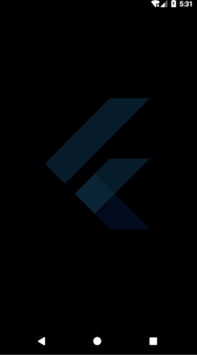

=== "iOS"

    

### Как добавить анимацию пролистывания карт?

В React Native для анимации пролистывания используется либо `PanResponder`, либо сторонние библиотеки.

Во Flutter для добавления анимации пролистывания используется виджет [`Dismissible`][] и вложенные дочерние виджеты.

```dart title="Dart"
return Dismissible(
  key: Key(widget.key.toString()),
  onDismissed: (dismissDirection) {
    cards.removeLast();
  },
  child: Container(
      //...
      ),
);
```

=== "Android"

    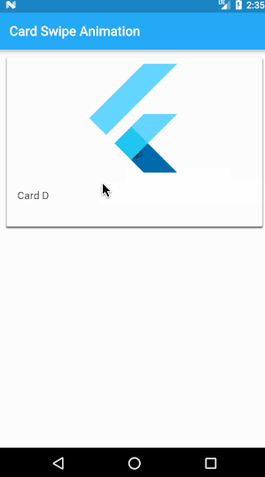

=== "iOS"

    

## Эквивалентные компоненты виджетов React Native и Flutter

В следующей таблице перечислены часто используемые компоненты React Native, сопоставленные с соответствующими виджетами Flutter и общими свойствами виджетов.

| React Native Component                                                                     | Flutter Widget                  | Description                                                                                                                                                                 |
| ------------------------------------------------------------------------------------------ | ------------------------------- | --------------------------------------------------------------------------------------------------------------------------------------------------------------------------- |
| [`Button`](https://facebook.github.io/react-native/docs/button.html)                       | [`ElevatedButton`][]            | A basic raised button.                                                                                                                                                      |
|                                                                                            | onPressed [required]            | The callback when the button is tapped or otherwise activated.                                                                                                              |
|                                                                                            | Child                           | The button's label.                                                                                                                                                         |
|                                                                                            |                                 |                                                                                                                                                                             |
| [`Button`](https://facebook.github.io/react-native/docs/button.html)                       | [`TextButton`][]                | A basic flat button.                                                                                                                                                        |
|                                                                                            | onPressed [required]            | The callback when the button is tapped or otherwise activated.                                                                                                              |
|                                                                                            | Child                           | The button's label.                                                                                                                                                         |
|                                                                                            |                                 |                                                                                                                                                                             |
| [`ScrollView`](https://facebook.github.io/react-native/docs/scrollview.html)               | [`ListView`][]                  | A scrollable list of widgets arranged linearly.                                                                                                                             |
|                                                                                            | children                        | ( <Widget\> [ ]) List of child widgets to display.                                                                                                                          |
|                                                                                            | controller                      | [ [`ScrollController`][] ] An object that can be used to control a scrollable widget.                                                                                       |
|                                                                                            | itemExtent                      | [ double ] If non-null, forces the children to have the given extent in the scroll direction.                                                                               |
|                                                                                            | scroll Direction                | [ [`Axis`][] ] The axis along which the scroll view scrolls.                                                                                                                |
|                                                                                            |                                 |                                                                                                                                                                             |
| [`FlatList`](https://facebook.github.io/react-native/docs/flatlist.html)                   | [`ListView.builder`][]          | The constructor for a linear array of widgets that are created on demand.                                                                                                   |
|                                                                                            | itemBuilder [required]          | [[`IndexedWidgetBuilder`][]] helps in building the children on demand. This callback is called only with indices greater than or equal to zero and less than the itemCount. |
|                                                                                            | itemCount                       | [ int ] improves the ability of the `ListView` to estimate the maximum scroll extent.                                                                                       |
|                                                                                            |                                 |                                                                                                                                                                             |
| [`Image`](https://facebook.github.io/react-native/docs/image.html)                         | [`Image`][]                     | A widget that displays an image.                                                                                                                                            |
|                                                                                            | image [required]                | The image to display.                                                                                                                                                       |
|                                                                                            | Image. asset                    | Several constructors are provided for the various ways that an image can be specified.                                                                                      |
|                                                                                            | width, height, color, alignment | The style and layout for the image.                                                                                                                                         |
|                                                                                            | fit                             | Inscribing the image into the space allocated during layout.                                                                                                                |
|                                                                                            |                                 |                                                                                                                                                                             |
| [`Modal`](https://facebook.github.io/react-native/docs/modal.html)                         | [`ModalRoute`][]                | A route that blocks interaction with previous routes.                                                                                                                       |
|                                                                                            | animation                       | The animation that drives the route's transition and the previous route's forward transition.                                                                               |
|                                                                                            |                                 |                                                                                                                                                                             |
| [`ActivityIndicator`](https://facebook.github.io/react-native/docs/activityindicator.html) | [`CircularProgressIndicator`][] | A widget that shows progress along a circle.                                                                                                                                |
|                                                                                            | strokeWidth                     | The width of the line used to draw the circle.                                                                                                                              |
|                                                                                            | backgroundColor                 | The progress indicator's background color. The current theme's `ThemeData.backgroundColor` by default.                                                                      |
|                                                                                            |                                 |                                                                                                                                                                             |
| [`ActivityIndicator`](https://facebook.github.io/react-native/docs/activityindicator.html) | [`LinearProgressIndicator`][]   | A widget that shows progress along a line.                                                                                                                                  |
|                                                                                            | value                           | The value of this progress indicator.                                                                                                                                       |
|                                                                                            |                                 |                                                                                                                                                                             |
| [`RefreshControl`](https://facebook.github.io/react-native/docs/refreshcontrol.html)       | [`RefreshIndicator`][]          | A widget that supports the Material "swipe to refresh" idiom.                                                                                                               |
|                                                                                            | color                           | The progress indicator's foreground color.                                                                                                                                  |
|                                                                                            | onRefresh                       | A function that's called when a user drags the refresh indicator far enough to demonstrate that they want the app to refresh.                                               |
|                                                                                            |                                 |                                                                                                                                                                             |
| [`View`](https://facebook.github.io/react-native/docs/view.html)                           | [`Container`][]                 | A widget that surrounds a child widget.                                                                                                                                     |
|                                                                                            |                                 |                                                                                                                                                                             |
| [`View`](https://facebook.github.io/react-native/docs/view.html)                           | [`Column`][]                    | A widget that displays its children in a vertical array.                                                                                                                    |
|                                                                                            |                                 |                                                                                                                                                                             |
| [`View`](https://facebook.github.io/react-native/docs/view.html)                           | [`Row`][]                       | A widget that displays its children in a horizontal array.                                                                                                                  |
|                                                                                            |                                 |                                                                                                                                                                             |
| [`View`](https://facebook.github.io/react-native/docs/view.html)                           | [`Center`][]                    | A widget that centers its child within itself.                                                                                                                              |
|                                                                                            |                                 |                                                                                                                                                                             |
| [`View`](https://facebook.github.io/react-native/docs/view.html)                           | [`Padding`][]                   | A widget that insets its child by the given padding.                                                                                                                        |
|                                                                                            | padding [required]              | [ EdgeInsets ] The amount of space to inset the child.                                                                                                                      |
|                                                                                            |                                 |
| [`TouchableOpacity`](https://facebook.github.io/react-native/docs/touchableopacity.html)   | [`GestureDetector`][]           | A widget that detects gestures.                                                                                                                                             |
|                                                                                            | onTap                           | A callback when a tap occurs.                                                                                                                                               |
|                                                                                            | onDoubleTap                     | A callback when a tap occurs at the same location twice in quick succession.                                                                                                |
|                                                                                            |                                 |
| [`TextInput`](https://facebook.github.io/react-native/docs/textinput.html)                 | [`TextInput`][]                 | The interface to the system's text input control.                                                                                                                           |
|                                                                                            | controller                      | [ [`TextEditingController`][] ] used to access and modify text.                                                                                                             |
|                                                                                            |                                 |
| [`Text`](https://facebook.github.io/react-native/docs/text.html)                           | [`Text`][]                      | The Text widget that displays a string of text with a single style.                                                                                                         |
|                                                                                            | data                            | [ String ] The text to display.                                                                                                                                             |
|                                                                                            | textDirection                   | [ [`TextAlign`][] ] The direction in which the text flows.                                                                                                                  |
|                                                                                            |                                 |                                                                                                                                                                             |
| [`Switch`](https://facebook.github.io/react-native/docs/switch.html)                       | [`Switch`][]                    | A material design switch.                                                                                                                                                   |
|                                                                                            | value [required]                | [ boolean ] Whether this switch is on or off.                                                                                                                               |
|                                                                                            | onChanged [required]            | [ callback ] Called when the user toggles the switch on or off.                                                                                                             |
|                                                                                            |                                 |                                                                                                                                                                             |
| [`Slider`](https://facebook.github.io/react-native/docs/slider.html)                       | [`Slider`][]                    | Used to select from a range of values.                                                                                                                                      |
|                                                                                            | value [required]                | [ double ] The current value of the slider.                                                                                                                                 |
|                                                                                            | onChanged [required]            | Called when the user selects a new value for the slider.                                                                                                                    |

[aboutdialog]: https://api.flutter.dev/flutter/material/AboutDialog-class.html
[adding assets and images in flutter]: https://docs.flutter.dev/ui/assets/assets-and-images
[`alertdialog`]: https://api.flutter.dev/flutter/material/AlertDialog-class.html
[`align`]: https://api.flutter.dev/flutter/widgets/Align-class.html
[`animation`]: https://api.flutter.dev/flutter/animation/Animation-class.html
[`animationcontroller`]: https://api.flutter.dev/flutter/animation/AnimationController-class.html
[async and await]: https://dart.dev/language/async
[`axis`]: https://api.flutter.dev/flutter/painting/Axis.html
[`buildcontext`]: https://api.flutter.dev/flutter/widgets/BuildContext-class.html
[`center`]: https://api.flutter.dev/flutter/widgets/Center-class.html
[color palette]: https://m2.material.io/design/color/the-color-system.html#color-theme-creation
[colors]: https://api.flutter.dev/flutter/material/Colors-class.html
[`colors`]: https://api.flutter.dev/flutter/material/Colors-class.html
[`column`]: https://api.flutter.dev/flutter/widgets/Column-class.html
[`container`]: https://api.flutter.dev/flutter/widgets/Container-class.html
[`checkbox`]: https://api.flutter.dev/flutter/material/Checkbox-class.html
[`circleavatar`]: https://api.flutter.dev/flutter/material/CircleAvatar-class.html
[`circularprogressindicator`]: https://api.flutter.dev/flutter/material/CircularProgressIndicator-class.html
[cupertino (ios-style)]: https://docs.flutter.dev/ui/widgets/cupertino
[`custompaint`]: https://api.flutter.dev/flutter/widgets/CustomPaint-class.html
[`custompainter`]: https://api.flutter.dev/flutter/rendering/CustomPainter-class.html
[dart]: https://dart.dev/dart-2
[dart's type system]: https://dart.dev/guides/language/sound-dart
[sound null safety]: https://dart.dev/null-safety
[`dart:io`]: https://api.flutter.dev/flutter/dart-io/dart-io-library.html
[dartpada]: https://dartpad.dev/0df636e00f348bdec2bc1c8ebc7daeb1
[dartpadb]: https://dartpad.dev/cf9e652f77636224d3e37d96dcf238e5
[dartpadc]: https://dartpad.dev/3f4625c16e05eec396d6046883739612
[dartpadd]: https://dartpad.dev/57ec21faa8b6fe2326ffd74e9781a2c7
[dartpade]: https://dartpad.dev/c85038ad677963cb6dc943eb1a0b72e6
[dartpadf]: https://dartpad.dev/5454e8bfadf3000179d19b9bc6be9918
[developing packages & plugins]: https://docs.flutter.dev/packages-and-plugins/developing-packages
[devtools]: https://docs.flutter.dev/tools/devtools
[`dismissible`]: https://api.flutter.dev/flutter/widgets/Dismissible-class.html
[`fadetransition`]: https://api.flutter.dev/flutter/widgets/FadeTransition-class.html
[flutter packages]: https://pub.dev/flutter/
[flutter architectural overview]: https://docs.flutter.dev/resources/architectural-overview
[flutter basic widgets]: https://docs.flutter.dev/ui/widgets/basics
[flutter technical overview]: https://docs.flutter.dev/resources/architectural-overview
[flutter widget catalog]: https://docs.flutter.dev/ui/widgets
[flutter widget index]: https://docs.flutter.dev/reference/widgets
[`flutterlogo`]: https://api.flutter.dev/flutter/material/FlutterLogo-class.html
[`form`]: https://api.flutter.dev/flutter/widgets/Form-class.html
[`textbutton`]: https://api.flutter.dev/flutter/material/TextButton-class.html
[functions]: https://dart.dev/language/functions
[future]: https://dart.dev/tutorials/language/futures
[`gesturedetector`]: https://api.flutter.dev/flutter/widgets/GestureDetector-class.html
[getting started]: https://docs.flutter.dev/get-started
[`image`]: https://api.flutter.dev/flutter/widgets/Image-class.html
[`indexedwidgetbuilder`]: https://api.flutter.dev/flutter/widgets/IndexedWidgetBuilder.html
[`inheritedwidget`]: https://api.flutter.dev/flutter/widgets/InheritedWidget-class.html
[`inkwell`]: https://api.flutter.dev/flutter/material/InkWell-class.html
[layout widgets]: https://docs.flutter.dev/ui/widgets/layout
[`linearprogressindicator`]: https://api.flutter.dev/flutter/material/LinearProgressIndicator-class.html
[`listtile`]: https://api.flutter.dev/flutter/material/ListTile-class.html
[`listview`]: https://api.flutter.dev/flutter/widgets/ListView-class.html
[`listview.builder`]: https://api.flutter.dev/flutter/widgets/ListView/ListView.builder.html
[material design]: https://m3.material.io/styles
[material icons]: https://api.flutter.dev/flutter/material/Icons-class.html
[`materialapp`]: https://api.flutter.dev/flutter/material/MaterialApp-class.html
[`materialpageroute`]: https://api.flutter.dev/flutter/material/MaterialPageRoute-class.html
[`modalroute`]: https://api.flutter.dev/flutter/widgets/ModalRoute-class.html
[`navigator`]: https://api.flutter.dev/flutter/widgets/Navigator-class.html
[`navigator.of()`]: https://api.flutter.dev/flutter/widgets/Navigator/of.html
[`navigator.pop`]: https://api.flutter.dev/flutter/widgets/Navigator/pop.html
[`navigator.push`]: https://api.flutter.dev/flutter/widgets/Navigator/push.html
[`onsaved`]: https://api.flutter.dev/flutter/widgets/FormField/onSaved.html
[named parameters]: https://dart.dev/language/functions#named-parameters
[`padding`]: https://api.flutter.dev/flutter/widgets/Padding-class.html
[`panresponder`]: https://facebook.github.io/react-native/docs/panresponder.html
[pub.dev]: https://pub.dev
[`radio`]: https://api.flutter.dev/flutter/material/Radio-class.html
[`elevatedbutton`]: https://api.flutter.dev/flutter/material/ElevatedButton-class.html
[`refreshindicator`]: https://api.flutter.dev/flutter/material/RefreshIndicator-class.html
[`route`]: https://api.flutter.dev/flutter/widgets/Route-class.html
[`row`]: https://api.flutter.dev/flutter/widgets/Row-class.html
[`scaffold`]: https://api.flutter.dev/flutter/material/Scaffold-class.html
[`scrollcontroller`]: https://api.flutter.dev/flutter/widgets/ScrollController-class.html
[`shared_preferences`]: https://github.com/flutter/plugins/tree/main/packages/shared_preferences
[`singletickerproviderstatemixin`]: https://api.flutter.dev/flutter/widgets/SingleTickerProviderStateMixin-mixin.html
[`slider`]: https://api.flutter.dev/flutter/material/Slider-class.html
[`stack`]: https://api.flutter.dev/flutter/widgets/Stack-class.html
[state management]: https://docs.flutter.dev/data-and-backend/state-mgmt
[`statefulwidget`]: https://api.flutter.dev/flutter/widgets/StatefulWidget-class.html
[`statelesswidget`]: https://api.flutter.dev/flutter/widgets/StatelessWidget-class.html
[`switch`]: https://api.flutter.dev/flutter/material/Switch-class.html
[`tab`]: https://api.flutter.dev/flutter/material/Tab-class.html
[`tabbar`]: https://api.flutter.dev/flutter/material/TabBar-class.html
[`tabbarview`]: https://api.flutter.dev/flutter/material/TabBarView-class.html
[`tabcontroller`]: https://api.flutter.dev/flutter/material/TabController-class.html
[`text`]: https://api.flutter.dev/flutter/widgets/Text-class.html
[`textalign`]: https://api.flutter.dev/flutter/dart-ui/TextAlign.html
[`texteditingcontroller`]: https://api.flutter.dev/flutter/widgets/TextEditingController-class.html
[`textfield`]: https://api.flutter.dev/flutter/material/TextField-class.html
[`textformfield`]: https://api.flutter.dev/flutter/material/TextFormField-class.html
[`textinput`]: https://api.flutter.dev/flutter/services/TextInput-class.html
[`textstyle`]: https://api.flutter.dev/flutter/dart-ui/TextStyle-class.html
[`theme`]: https://api.flutter.dev/flutter/material/Theme-class.html
[`themedata`]: https://api.flutter.dev/flutter/material/ThemeData-class.html
[`ticker`]: https://api.flutter.dev/flutter/scheduler/Ticker-class.html
[`tickerprovider`]: https://api.flutter.dev/flutter/scheduler/TickerProvider-class.html
[`tickerproviderstatemixin`]: https://api.flutter.dev/flutter/widgets/TickerProviderStateMixin-mixin.html
[`tween`]: https://api.flutter.dev/flutter/animation/Tween-class.html
[using packages]: https://docs.flutter.dev/packages-and-plugins/using-packages
[variables]: https://dart.dev/language/variables
[`widgetbuilder`]: https://api.flutter.dev/flutter/widgets/WidgetBuilder.html
[infinite_list]: https://github.com/flutter/samples/tree/main/infinite_list
