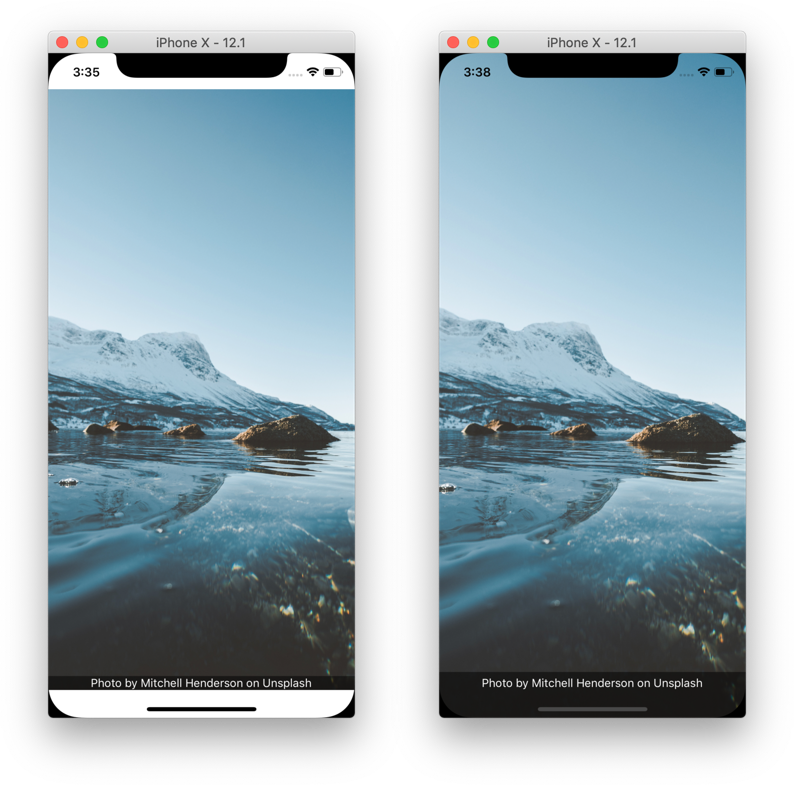

# Поддержка безопасных зон

По умолчанию React Navigation старается обеспечить корректное отображение элементов навигаторов на устройствах с выемками (например, iPhone X) и элементами пользовательского интерфейса, которые могут перекрывать содержимое приложения. К таким элементам относятся:

-   Физические выемки
-   Наложение строки состояния
-   Индикатор домашней активности на iOS
-   Навигационная панель на Android

Область, не перекрываемая такими элементами, называется "безопасной областью".

Мы стараемся применять соответствующие вставки к элементам пользовательского интерфейса навигаторов, чтобы избежать перекрытия такими элементами. Цель состоит в том, чтобы (а) максимально эффективно использовать экран (б), не скрывая содержимое и не затрудняя взаимодействие с ним из-за того, что оно заслоняется физическим вырезом дисплея или каким-либо пользовательским интерфейсом операционной системы.

Хотя React Navigation по умолчанию обрабатывает безопасные области для встроенных элементов пользовательского интерфейса, для обеспечения того, чтобы контент не был скрыт этими элементами, может потребоваться обработка и вашего собственного контента.

Заманчиво решить проблему (a), обернув все приложение в контейнер с подложкой, которая гарантирует, что все содержимое не будет закрыто. Но при этом мы теряем много места на экране, как показано на изображении слева внизу. В идеале мы хотим получить изображение, показанное справа.



Хотя React Native экспортирует компонент `SafeAreaView`, он поддерживает только iOS 10+ без поддержки старых версий iOS и Android. Кроме того, он также имеет некоторые проблемы, например, если экран, содержащий безопасную область, анимируется, то это приводит к скачкообразному поведению. Поэтому мы рекомендуем использовать хук `useSafeAreaInsets` из библиотеки [react-native-safe-area-context](https://github.com/th3rdwave/react-native-safe-area-context) для более надежной работы с безопасными областями.

!!!note "Примечание"

    Библиотека `react-native-safe-area-context` также экспортирует компонент `SafeAreaView`. Он работает на Android, но имеет те же проблемы, связанные со скачкообразным поведением при анимации. Поэтому мы рекомендуем всегда использовать хук `useSafeAreaInsets` и избегать использования компонента `SafeAreaView`.

В остальной части этого руководства приводится более подробная информация о поддержке безопасных областей в React Navigation.

## Скрытый/настраиваемый заголовок или панель вкладок


React Navigation обрабатывает безопасную область в заголовке по умолчанию. Однако если вы используете пользовательский заголовок, важно убедиться, что ваш пользовательский интерфейс находится в безопасной области.

Например, если я ничего не отображаю для `header` или `tabBar`, то ничего не отображается

```jsx
import * as React from 'react';
import { Text, View } from 'react-native';
import { NavigationContainer } from '@react-navigation/native';
import { createBottomTabNavigator } from '@react-navigation/bottom-tabs';
import { createNativeStackNavigator } from '@react-navigation/native-stack';

function Demo() {
    return (
        <View
            style={{
                flex: 1,
                justifyContent: 'space-between',
                alignItems: 'center',
            }}
        >
            <Text>This is top text.</Text>
            <Text>This is bottom text.</Text>
        </View>
    );
}
const Stack = createNativeStackNavigator();
const Tab = createBottomTabNavigator();

export default function App() {
    return (
        <NavigationContainer>
            <Stack.Navigator
                initialRouteName="Home"
                screenOptions={{ headerShown: false }}
            >
                <Stack.Screen name="Home">
                    {() => (
                        <Tab.Navigator
                            initialRouteName="Analitics"
                            tabBar={() => null}
                            screenOptions={{
                                headerShown: false,
                            }}
                        >
                            <Tab.Screen
                                name="Analitics"
                                component={Demo}
                            />
                            <Tab.Screen
                                name="Profile"
                                component={Demo}
                            />
                        </Tab.Navigator>
                    )}
                </Stack.Screen>

                <Stack.Screen
                    name="Settings"
                    component={Demo}
                />
            </Stack.Navigator>
        </NavigationContainer>
    );
}
```


Чтобы решить эту проблему, можно применить вставки безопасных областей к содержимому. Этого можно добиться с помощью хука `useSafeAreaInsets` из библиотеки `react-native-safe-area-context`:

```jsx
import {
    SafeAreaProvider,
    useSafeAreaInsets,
} from 'react-native-safe-area-context';

function Demo() {
    const insets = useSafeAreaInsets();

    return (
        <View
            style={{
                flex: 1,
                justifyContent: 'space-between',
                alignItems: 'center',

                // Paddings to handle safe area
                paddingTop: insets.top,
                paddingBottom: insets.bottom,
                paddingLeft: insets.left,
                paddingRight: insets.right,
            }}
        >
            <Text>This is top text.</Text>
            <Text>This is bottom text.</Text>
        </View>
    );
}

export default function App() {
    return (
        <SafeAreaProvider>
            <NavigationContainer>
                {/*(...) */}
            </NavigationContainer>
        </SafeAreaProvider>
    );
}
```

Обязательно оберните свое приложение в `SafeAreaProvider` в соответствии с инструкциями [здесь](https://github.com/th3rdwave/react-native-safe-area-context#usage).


Это позволит определить, запущено ли приложение на устройстве с выемками, и если да, то убедиться, что контент не скрыт за аппаратными элементами.

## Пейзажный режим

Даже если вы используете стандартную панель навигации и панель вкладок, если ваше приложение работает в ландшафтном режиме, важно убедиться, что содержимое не скрыто за кластером датчиков.


Чтобы исправить это, можно снова применить вставки безопасной области к содержимому. При этом ни панель навигации, ни панель вкладок не будут конфликтовать с поведением по умолчанию в книжном режиме.


## Использование крючка для большего контроля

В некоторых случаях может потребоваться больший контроль над тем, какие отступы применяются. Например, изменяя объект `style`, можно применить только верхнюю и нижнюю отступы:

```jsx
import { useSafeAreaInsets } from 'react-native-safe-area-context';

function Demo() {
    const insets = useSafeAreaInsets();

    return (
        <View
            style={{
                paddingTop: insets.top,
                paddingBottom: insets.bottom,

                flex: 1,
                justifyContent: 'space-between',
                alignItems: 'center',
            }}
        >
            <Text>This is top text.</Text>
            <Text>This is bottom text.</Text>
        </View>
    );
}
```

Аналогичным образом можно применить эти отступы в `contentContainerStyle` для `FlatList`, чтобы содержимое не попадало в безопасные области, но при этом отображалось под строкой состояния и навигационной строкой при прокрутке.

## Резюме

-   Используйте хук `useSafeAreaInsets` из `react-native-safe-area-context` вместо компонента `SafeAreaView`.
-   Не оборачивайте все приложение в `SafeAreaView`, вместо этого применяйте стили к содержимому внутри экранов
-   Применяйте только определенные вставки с помощью хука `useSafeAreaInsets` для большего контроля

## Ссылки

-   [Supporting safe areas](https://reactnavigation.org/docs/handling-safe-area)
