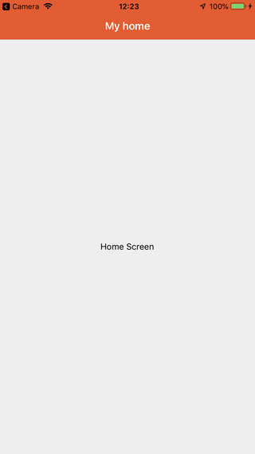

# Настройка строки заголовка

Мы уже видели, как настраивать заголовок, но давайте повторим это еще раз, прежде чем переходить к другим опциям &mdash; повторение - ключ к обучению!

## Настройка заголовка

Компонент `Screen` принимает реквизит `options`, который представляет собой либо объект, либо функцию, возвращающую объект, содержащий различные параметры конфигурации. Для заголовка мы используем `title`, как показано в следующем примере.

```js
function StackScreen() {
    return (
        <Stack.Navigator>
            <Stack.Screen
                name="Home"
                component={HomeScreen}
                options={{ title: 'My home' }}
            />
        </Stack.Navigator>
    );
}
```

## Использование параметров в заголовке

Для того чтобы использовать параметры в заголовке, нам необходимо сделать проп `options` для экрана функцией, возвращающей объект конфигурации. Может возникнуть соблазн попытаться использовать `this.props` внутри `options`, но поскольку он определяется до отрисовки компонента, `this` не ссылается на экземпляр компонента, и поэтому никакие props не доступны. Вместо этого, если мы сделаем `options` функцией, то React Navigation вызовет ее с объектом, содержащим `{ navigation, route }` - в этом случае нам важен только `route`, который является тем же объектом, который передается в реквизит screen props как реквизит `route`. Вы можете вспомнить, что мы можем получить параметры через `route.params`, и поэтому ниже мы сделаем это, чтобы извлечь параметр и использовать его в качестве заголовка.

```js
function StackScreen() {
    return (
        <Stack.Navigator>
            <Stack.Screen
                name="Home"
                component={HomeScreen}
                options={{ title: 'My home' }}
            />
            <Stack.Screen
                name="Profile"
                component={ProfileScreen}
                options={({ route }) => ({
                    title: route.params.name,
                })}
            />
        </Stack.Navigator>
    );
}
```

Аргументом, передаваемым функции `options`, является объект со следующими свойствами:

-   `navigation` - Свойство [navigation prop](navigation-prop.md) для экрана.
-   `route` - Свойство [route prop](route-prop.md) для экрана.

В приведенном примере нам понадобился только параметр `route`, но в некоторых случаях вы можете использовать и `navigation`.

## Обновление `options` с помощью `setOptions`

Часто бывает необходимо обновить конфигурацию `options` для активного экрана из самого компонента mounted screen. Это можно сделать с помощью функции `navigation.setOptions`

```js
/* Inside of render() of React class */
<Button
    title="Update the title"
    onPress={() =>
        navigation.setOptions({ title: 'Updated!' })
    }
/>
```

## Настройка стилей заголовков

При настройке стиля заголовка необходимо использовать три ключевых свойства: `headerStyle`, `headerTintColor` и `headerTitleStyle`.

-   `headerStyle`: объект стиля, который будет применяться к `View`, оборачивающему заголовок. Если вы установите для него `backgroundColor`, то это будет цвет вашего заголовка.
-   `headerTintColor`: кнопка "Назад" и заголовок используют это свойство в качестве цвета. В приведенном ниже примере мы установили белый цвет оттенка (`#fff`), поэтому кнопка "Назад" и заголовок будут белыми.
-   `headerTitleStyle`: если мы хотим настроить `fontFamily`, `fontWeight` и другие свойства стиля `Text` для заголовка, мы можем использовать это свойство.

```js
function StackScreen() {
    return (
        <Stack.Navigator>
            <Stack.Screen
                name="Home"
                component={HomeScreen}
                options={{
                    title: 'My home',
                    headerStyle: {
                        backgroundColor: '#f4511e',
                    },
                    headerTintColor: '#fff',
                    headerTitleStyle: {
                        fontWeight: 'bold',
                    },
                }}
            />
        </Stack.Navigator>
    );
}
```



Здесь следует отметить несколько моментов:

1.  В iOS текст и значки строки состояния черные, и это не очень хорошо смотрится на темном фоне. Мы не будем обсуждать это здесь, но вы должны обязательно настроить строку состояния в соответствии с цветами вашего экрана [как описано в руководстве по строке состояния](status-bar.md).
2.  Заданная нами конфигурация применяется только к главному экрану; при переходе к экрану подробностей возвращаются стили по умолчанию. Теперь мы рассмотрим, как обмениваться `опциями` между экранами.

## Совместное использование общих `опций` на разных экранах

Часто бывает так, что на многих экранах требуется настроить заголовок одинаковым образом. Например, фирменный цвет вашей компании может быть красным, поэтому цвет фона заголовка должен быть красным, а цвет оттенка - белым. Удобно, что именно эти цвета мы используем в нашем примере, и вы заметите, что при переходе на экран `DetailsScreen` цвета возвращаются к значениям по умолчанию. Было бы ужасно, если бы нам пришлось копировать свойства стиля заголовка `options` из `HomeScreen` в `DetailsScreen`, причем для каждого компонента экрана, используемого в нашем приложении? К счастью, это не так. Вместо этого мы можем перенести конфигурацию в нативный навигатор стека под свойством `screenOptions`.

```js
function StackScreen() {
    return (
        <Stack.Navigator
            screenOptions={{
                headerStyle: {
                    backgroundColor: '#f4511e',
                },
                headerTintColor: '#fff',
                headerTitleStyle: {
                    fontWeight: 'bold',
                },
            }}
        >
            <Stack.Screen
                name="Home"
                component={HomeScreen}
                options={{ title: 'My home' }}
            />
        </Stack.Navigator>
    );
}
```

Теперь любой экран, принадлежащий `Stack.Navigator`, будет иметь наши замечательные фирменные стили. Но, конечно же, должен быть способ переопределить эти опции, если это необходимо?

## Замена заголовка пользовательским компонентом

Иногда требуется более широкий контроль, чем просто изменение текста и стилей заголовка - например, вместо заголовка можно вывести изображение или превратить заголовок в кнопку. В этих случаях можно полностью переопределить компонент, используемый для заголовка, и создать свой собственный.

```js
function LogoTitle() {
    return (
        <Image
            style={{ width: 50, height: 50 }}
            source={require('@expo/snack-static/react-native-logo.png')}
        />
    );
}

function StackScreen() {
    return (
        <Stack.Navigator>
            <Stack.Screen
                name="Home"
                component={HomeScreen}
                options={{
                    headerTitle: (props) => (
                        <LogoTitle {...props} />
                    ),
                }}
            />
        </Stack.Navigator>
    );
}
```

!!!note ""

    Вы можете задаться вопросом, почему именно `headerTitle`, когда мы предоставляем компонент, а не `title`, как раньше? Причина в том, что `headerTitle` - это свойство, специфичное для стековых навигаторов, а `headerTitle` по умолчанию соответствует компоненту `Text`, который отображает `title`.

## Дополнительная конфигурация

Полный список доступных `опций` для экранов внутри нативного стекового навигатора можно прочитать в справке [`createNativeStackNavigator`](native-stack-navigator.md#options).

## Резюме

-   Вы можете настроить заголовок внутри свойства `options` компонентов экрана. Ознакомьтесь с полным списком опций [в справке по API](native-stack-navigator.md#options).
-   Реквизит `options` может быть объектом или функцией. Если это функция, то ей предоставляется объект с реквизитами `navigation` и `route`.
-   Вы также можете указать общие `screenOptions` в конфигурации навигатора стека при его инициализации. Реквизит имеет приоритет над этой конфигурацией.

## Ссылки

-   [Configuring the header bar](https://reactnavigation.org/docs/headers/)
