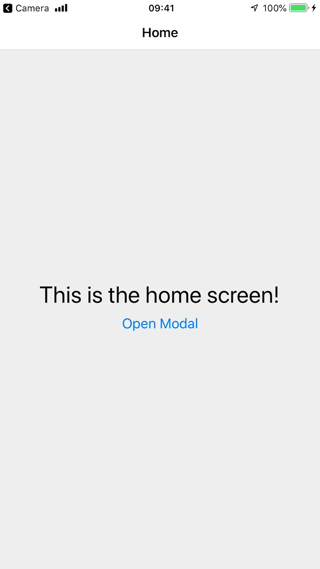

# Открытие модального окна



Модальное окно отображает содержимое, которое временно блокирует взаимодействие с основным видом.

Модальный экран похож на всплывающее окно &mdash; он не является частью основного навигационного потока &mdash; он обычно имеет другой переход, другой способ его отклонения и предназначен для концентрации внимания на одном конкретном фрагменте содержимого или взаимодействия.

## Создание стека с модальными экранами

```js
function HomeScreen({ navigation }) {
    return (
        <View
            style={{
                flex: 1,
                alignItems: 'center',
                justifyContent: 'center',
            }}
        >
            <Text style={{ fontSize: 30 }}>
                This is the home screen!
            </Text>
            <Button
                onPress={() =>
                    navigation.navigate('MyModal')
                }
                title="Open Modal"
            />
        </View>
    );
}

function DetailsScreen() {
    return (
        <View>
            <Text>Details</Text>
        </View>
    );
}

function ModalScreen({ navigation }) {
    return (
        <View
            style={{
                flex: 1,
                alignItems: 'center',
                justifyContent: 'center',
            }}
        >
            <Text style={{ fontSize: 30 }}>
                This is a modal!
            </Text>
            <Button
                onPress={() => navigation.goBack()}
                title="Dismiss"
            />
        </View>
    );
}

const RootStack = createStackNavigator();

function RootStackScreen() {
    return (
        <RootStack.Navigator>
            <RootStack.Group>
                <RootStack.Screen
                    name="Home"
                    component={HomeScreen}
                />
                <RootStack.Screen
                    name="Details"
                    component={DetailsScreen}
                />
            </RootStack.Group>
            <RootStack.Group
                screenOptions={{ presentation: 'modal' }}
            >
                <RootStack.Screen
                    name="MyModal"
                    component={ModalScreen}
                />
            </RootStack.Group>
        </RootStack.Navigator>
    );
}
```

Здесь мы создаем две группы экранов с помощью компонента `RootStack.Group`. Первая группа предназначена для обычных экранов, а вторая - для модальных. Для группы модальных экранов мы указали `presentation: 'modal'` в `screenOptions`. Это позволит применить данную опцию ко всем экранам внутри группы. Эта опция изменит анимацию экранов на анимацию снизу вверх, а не справа налево. Опция `presentation` для стекового навигатора может быть либо `card` (по умолчанию), либо `modal`. При `modal` поведении экран выдвигается снизу и позволяет пользователю провести пальцем сверху вниз, чтобы убрать его на iOS.

Вместо того чтобы указывать эту опцию для группы, можно также указать ее для отдельного экрана с помощью свойства `options` в `RootStack.Screen`.

## Резюме

-   Для изменения типа перехода на стековом навигаторе можно использовать опцию `presentation`. Если установить значение `modal`, то все модальные экраны по умолчанию будут анимироваться снизу вверх, а не справа налево. Это относится ко всей группе, поэтому, чтобы использовать немодальные переходы на других экранах, мы добавляем еще одну группу с конфигурацией по умолчанию.

## Ссылки

-   [Opening a modal](https://reactnavigation.org/docs/modal)
