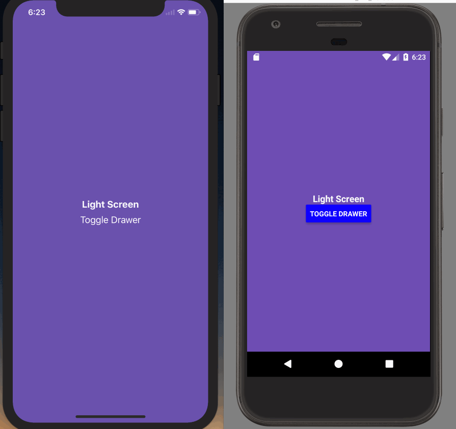
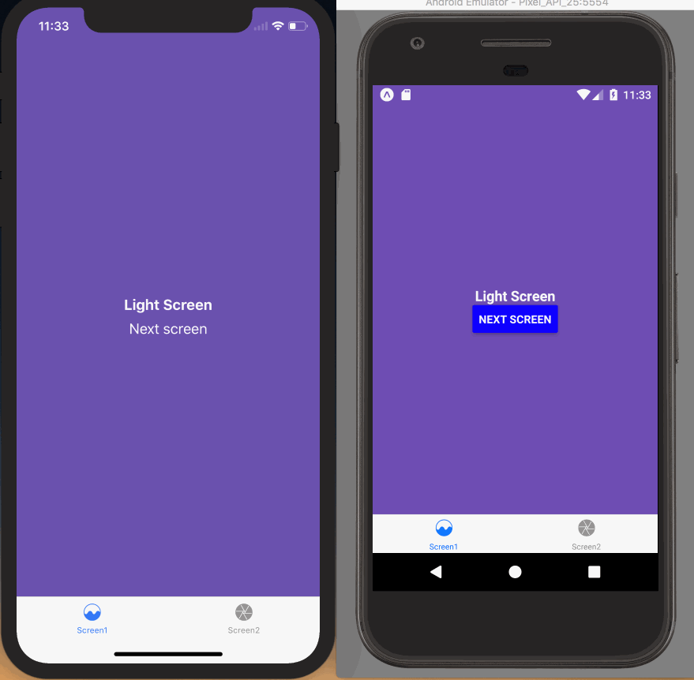

# Различная конфигурация строки состояния в зависимости от маршрута

Если у вас нет заголовка навигации или заголовок навигации меняет цвет в зависимости от маршрута, необходимо убедиться, что для содержимого используется правильный цвет.

## Стек

При использовании стека это простая задача. Вы можете отрендерить компонент `StatusBar`, открываемый React Native, и установить свой конфиг.

```js
import * as React from 'react';
import {
    View,
    Text,
    StatusBar,
    Button,
    StyleSheet,
} from 'react-native';
import { NavigationContainer } from '@react-navigation/native';
import { createNativeStackNavigator } from '@react-navigation/native-stack';
import {
    SafeAreaProvider,
    useSafeAreaInsets,
} from 'react-native-safe-area-context';

function Screen1({ navigation }) {
    const insets = useSafeAreaInsets();

    return (
        <View
            style={[
                styles.container,
                {
                    backgroundColor: '#6a51ae',
                    paddingTop: insets.top,
                    paddingBottom: insets.bottom,
                    paddingLeft: insets.left,
                    paddingRight: insets.right,
                },
            ]}
        >
            <StatusBar
                barStyle="light-content"
                backgroundColor="#6a51ae"
            />
            <Text style={{ color: '#fff' }}>
                Light Screen
            </Text>
            <Button
                title="Next screen"
                onPress={() =>
                    navigation.navigate('Screen2')
                }
                color="#fff"
            />
        </View>
    );
}

function Screen2({ navigation }) {
    const insets = useSafeAreaInsets();

    return (
        <View
            style={[
                styles.container,
                {
                    backgroundColor: '#ecf0f1',
                    paddingTop: insets.top,
                    paddingBottom: insets.bottom,
                    paddingLeft: insets.left,
                    paddingRight: insets.right,
                },
            ]}
        >
            <StatusBar
                barStyle="dark-content"
                backgroundColor="#ecf0f1"
            />
            <Text>Dark Screen</Text>
            <Button
                title="Next screen"
                onPress={() =>
                    navigation.navigate('Screen1')
                }
            />
        </View>
    );
}

const Stack = createNativeStackNavigator();

export default function App() {
    return (
        <SafeAreaProvider>
            <NavigationContainer>
                <Stack.Navigator
                    screenOptions={{ headerShown: false }}
                >
                    <Stack.Screen
                        name="Screen1"
                        component={Screen1}
                    />
                    <Stack.Screen
                        name="Screen2"
                        component={Screen2}
                    />
                </Stack.Navigator>
            </NavigationContainer>
        </SafeAreaProvider>
    );
}

const styles = StyleSheet.create({
    container: {
        flex: 1,
        justifyContent: 'center',
        alignItems: 'center',
    },
});
```


## Tabs и Drawer

Если вы используете навигатор табов или ящиков, то ситуация несколько усложняется, поскольку все экраны в навигаторе могут отрисовываться одновременно и сохраняться - это означает, что будет использоваться последняя установленная конфигурация `StatusBar` (скорее всего, на последней вкладке навигатора табов, а не на той, которую видит пользователь).

Чтобы решить эту проблему, необходимо сделать так, чтобы компонент строки состояния знал о фокусе экрана и отображал ее только тогда, когда экран сфокусирован. Этого можно добиться, используя хук [`useIsFocused`](use-is-focused.md) и создав компонент-обертку:

```js
import * as React from 'react';
import { StatusBar } from 'react-native';
import { useIsFocused } from '@react-navigation/native';

function FocusAwareStatusBar(props) {
    const isFocused = useIsFocused();

    return isFocused ? <StatusBar {...props} /> : null;
}
```

Теперь наши экраны (как `Screen1.js`, так и `Screen2.js`) будут использовать компонент `FocusAwareStatusBar` вместо компонента `StatusBar` из React Native:

```jsx
function Screen1({ navigation }) {
    const insets = useSafeAreaInsets();

    return (
        <View
            style={[
                styles.container,
                {
                    backgroundColor: '#6a51ae',
                    paddingTop: insets.top,
                    paddingBottom: insets.bottom,
                    paddingLeft: insets.left,
                    paddingRight: insets.right,
                },
            ]}
        >
            <FocusAwareStatusBar
                barStyle="light-content"
                backgroundColor="#6a51ae"
            />
            <Text style={{ color: '#fff' }}>
                Light Screen
            </Text>
            <Button
                title="Next screen"
                onPress={() =>
                    navigation.navigate('Screen2')
                }
                color="#fff"
            />
        </View>
    );
}

function Screen2({ navigation }) {
    const insets = useSafeAreaInsets();

    return (
        <View
            style={[
                styles.container,
                {
                    backgroundColor: '#ecf0f1',
                    paddingTop: insets.top,
                    paddingBottom: insets.bottom,
                    paddingLeft: insets.left,
                    paddingRight: insets.right,
                },
            ]}
        >
            <FocusAwareStatusBar
                barStyle="dark-content"
                backgroundColor="#ecf0f1"
            />
            <Text>Dark Screen</Text>
            <Button
                title="Next screen"
                onPress={() =>
                    navigation.navigate('Screen1')
                }
            />
        </View>
    );
}
```

Хотя это и не обязательно, компонент `FocusAwareStatusBar` можно использовать и в экранах "родного" стекового навигатора.




