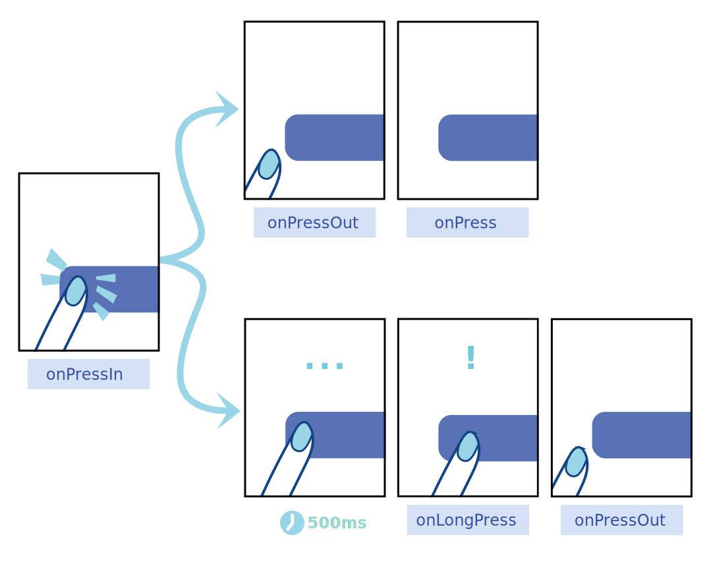

# Pressable

**Pressable** — это обертка Core Component, которая может обнаруживать различные стадии взаимодействия нажатия на любой из своих определенных дочерних компонентов.

```ts
<Pressable onPress={onPressFunction}>
    <Text>I'm pressable!</Text>
</Pressable>
```

## Как это работает

На элементе, обернутом `Pressable`:

-   [`onPressIn`](#onpressin) вызывается, когда активируется жест нажатия.
-   [`onPressOut`](#onpressout) вызывается при деактивации жеста нажатия.

После нажатия [`onPressIn`](#onpressin) произойдет одно из двух событий:

1.  Человек убирает палец, вызывая [`onPressOut`](#onpressout), за которым следует [`onPress`](#onpress).
2.  Если человек оставляет палец дольше, чем на 500 миллисекунд, то срабатывает [`onLongPress`](#onlongpress). ([`onPressOut`](#onpressout) все равно сработает, когда человек уберет палец).



Пальцы — не самые точные инструменты, и часто пользователи могут случайно активировать не тот элемент или пропустить область активации. Чтобы помочь, `Pressable` имеет дополнительный параметр `HitRect`, который можно использовать для определения расстояния, на котором прикосновение может быть зарегистрировано от обернутого элемента. Нажатия могут начинаться в любом месте в пределах `HitRect`.

`PressRect` позволяет нажатиям выходить за пределы элемента и его `HitRect`, сохраняя активацию и право на "нажатие" — представьте, что вы медленно отводите палец от кнопки, на которую нажимаете.

!!!note ""

    Область касания никогда не выходит за границы родительского представления, а Z-индекс родственных представлений всегда имеет приоритет, если касание попадает на два пересекающихся представления.

    

    `Pressable` использует API `Pressability` от React Native. Для получения дополнительной информации о том, как работает машина состояний Pressability, ознакомьтесь с реализацией для [Pressability](https://github.com/facebook/react-native/blob/main/packages/react-native/Libraries/Pressability/Pressability.js#L350).

## Пример

<div data-snack-id="@bndby/pressable" data-snack-platform="web" data-snack-preview="true" data-snack-theme="light" style="overflow:hidden;background:#F9F9F9;border:1px solid var(--color-border);border-radius:4px;height:505px;width:100%"></div>

## Пропсы

### `android_disableSound` :simple-android:

Если `true`, не воспроизводит системный звук Android при нажатии.

| Type    | Default |
| ------- | ------- |
| boolean | `false` |

### `android_ripple` :simple-android:

Включает эффект пульсации Android и настраивает его свойства.

| Type                                   |
| -------------------------------------- |
| [RippleConfig](pressable#rippleconfig) |

### `children`

Либо дочерние элементы, либо функция, которая получает булево значение, отражающее, нажат ли компонент в данный момент.

| Type                        |
| --------------------------- |
| [React Node](react-node.md) |

### `unstable_pressDelay`

Длительность (в миллисекундах) ожидания после нажатия кнопки вниз перед вызовом `onPressIn`.

| Type   |
| ------ |
| number |

### `delayLongPress`

Продолжительность (в миллисекундах) от `onPressIn` до вызова `onLongPress`.

| Type   | Default |
| ------ | ------- |
| number | `500`   |

### `disabled`

Отключено ли поведение нажатия.

| Тип     | По умолчанию |
| ------- | ------------ |
| boolean | `false`      |

### `hitSlop`

Устанавливает дополнительное расстояние за пределами элемента, на котором может быть обнаружено нажатие.

| Type                      |
| ------------------------- |
| [Rect](rect.md) или число |

### `onHoverIn`

Вызывается при активации hover для обеспечения визуальной обратной связи.

| Type                                                                                           |
| ---------------------------------------------------------------------------------------------- |
| ({ nativeEvent: [MouseEvent](https://developer.mozilla.org/docs/Web/API/MouseEvent) }) => void |

### `onLongPress`

Вызывается, если время после `onPressIn` длится более 500 миллисекунд. Этот период времени может быть настроен с помощью [`delayLongPress`](#delaylongpress).

| Тип                                                  |
| ---------------------------------------------------- |
| ({nativeEvent: [PressEvent](pressevent.md)}) => void |

### `onPress`

Вызывается после `onPressOut`.

| Type                                                 |
| ---------------------------------------------------- |
| ({nativeEvent: [PressEvent](pressevent.md)}) => void |

### `onPressIn`

Вызывается сразу после нажатия, перед `onPressOut` и `onPress`.

| Type                                                 |
| ---------------------------------------------------- |
| ({nativeEvent: [PressEvent](pressevent.md)}) => void |

### `onPressOut`

Вызывается при отпускании прикосновения.

| Type                                                 |
| ---------------------------------------------------- |
| ({nativeEvent: [PressEvent](pressevent.md)}) => void |

### `pressRetentionOffset`

Дополнительное расстояние за пределами этого представления, на котором прикосновение считается нажатием, прежде чем сработает `onPressOut`.

| Тип                    | По умолчанию                                 |
| ---------------------- | -------------------------------------------- |
| [Rect](rect) или число | `{bottom: 30, left: 20, right: 20, top: 20}` |

### `style`

Либо стили представления, либо функция, которая получает булево значение, отражающее, нажат ли компонент в данный момент, и возвращает стили представления.

| Type                                       |
| ------------------------------------------ |
| [Стиль представления](view-style-props.md) |

### `testOnly_pressed`

Используется только для документации или тестирования (например, тестирования моментального снимка).

| Тип     | По умолчанию |
| ------- | ------------ |
| boolean | `false`      |

## Определения типа

### RippleConfig

Конфигурация эффекта риппла для свойства `android_ripple`.

| Type   |
| ------ |
| object |

**Свойства:**

| Имя        | Тип             | Требуется | Описание                                                                                                                                                                                                                                                                  |
| ---------- | --------------- | --------- | ------------------------------------------------------------------------------------------------------------------------------------------------------------------------------------------------------------------------------------------------------------------------- |
| color      | [color](colors) | No        | Определяет цвет эффекта пульсации.                                                                                                                                                                                                                                        |
| borderless | boolean         | No        | Определяет, должен ли эффект пульсации не включать границы.                                                                                                                                                                                                               |
| radius     | число           | Нет       | Определяет радиус эффекта пульсации.                                                                                                                                                                                                                                      |
| foreground | boolean         | No        | Установите значение `true`, чтобы добавить эффект пульсации на передний план представления, а не на фон. Это полезно, если одно из дочерних представлений имеет свой собственный фон, или вы, например, отображаете изображения и не хотите, чтобы рябь была закрыта ими. |
