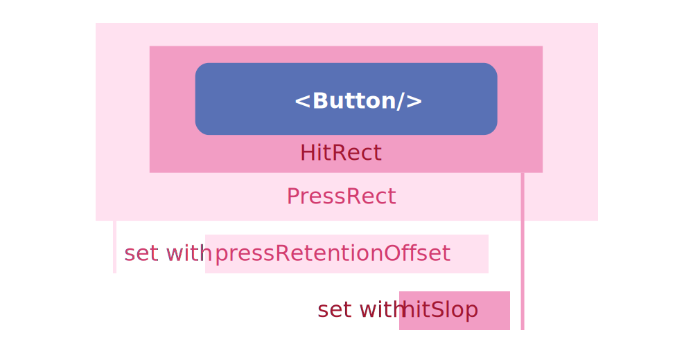

# Pressable

**`Pressable`** - это обертка компонента Core Component, которая может обнаруживать различные стадии взаимодействия с нажатием на любой из своих определенных дочерних компонентов.

```tsx
<Pressable onPress={onPressFunction}>
    <Text>I'm pressable!</Text>
</Pressable>
```

## Как это работает

На элементе, обернутом `Pressable`:

-   [`onPressIn`](#onpressin) вызывается при активации жеста нажатия.
-   [`onPressOut`](#onpressout) вызывается при деактивации жеста нажатия.

После нажатия кнопки [`onPressIn`](#onpressin) произойдет одно из двух событий:

1.  Человек убирает палец, вызывая [`onPressOut`](#onpressout), за которым следует [`onPress`](#onpress).

2.  Если человек оставляет палец дольше, чем на 500 миллисекунд, то срабатывает [`onLongPress`](#onlongpress). ([`onPressOut`](#onpressout) все равно сработает, когда человек уберет палец).


Пальцы - не самые точные инструменты, и часто пользователи могут случайно активировать не тот элемент или пропустить область активации. Чтобы помочь в этом, в `Pressable` есть дополнительный параметр `HitRect`, который можно использовать для определения расстояния, на котором регистрируется нажатие от обернутого элемента. Нажатия могут начинаться в любом месте `HitRect`.

`PressRect` позволяет нажатиям выходить за пределы элемента и его `HitRect`, сохраняя при этом активацию и право на "нажатие" - представьте, что вы медленно отводите палец от кнопки, на которую нажимаете.

!!!note ""

    Область касания никогда не выходит за границы родительского представления, а Z-индекс соседних представлений всегда имеет приоритет, если касание попадает на два пересекающихся представления.



You can set `HitRect` with `hitSlop` and set `PressRect` with `pressRetentionOffset`.

!!!warning ""

    `Pressable` использует API `Pressability` от React Native. Для получения более подробной информации о потоке машины состояний Pressability и о том, как она работает, ознакомьтесь с реализацией для [Pressability](https://github.com/facebook/react-native/blob/main/packages/react-native/Libraries/Pressability/Pressability.js#L350).

## Пример

<div data-snack-id="ank0FfgmW" data-snack-platform="web" data-snack-preview="true" data-snack-theme="light" style="overflow:hidden;background:#fbfcfd;border:1px solid var(--color-border);border-radius:4px;height:505px;width:100%"></div>

## Пропсы

### `android_disableSound` :simple-android:

Если значение `true`, то при нажатии не воспроизводится системный звук Android.

| Type    | Default |
| ------- | ------- |
| boolean | `false` |

### `android_ripple` :simple-android:

Включает эффект пульсации Android и настраивает его свойства.

| Type                          |
| ----------------------------- |
| [RippleConfig](#rippleconfig) |

### `children`

Либо дочерние элементы, либо функция, получающая логическое значение, отражающее, нажат ли компонент в данный момент.

| Type                        |
| --------------------------- |
| [React Node](react-node.md) |

### `unstable_pressDelay`

Длительность (в миллисекундах) ожидания после нажатия кнопки вниз перед вызовом `onPressIn`.

| Type   |
| ------ |
| number |

### `delayLongPress`

Длительность (в миллисекундах) с момента `onPressIn` до вызова `onLongPress`.

| Type   | Default |
| ------ | ------- |
| number | `500`   |

### `disabled`

Отключено ли поведение пресса.

| Type    | Default |
| ------- | ------- |
| boolean | `false` |

### `hitSlop`

Устанавливает дополнительное расстояние за пределами элемента, на котором может быть обнаружено нажатие.

| Type                      |
| ------------------------- |
| [Rect](rect.md) или число |

### `onHoverIn`

Вызывается при активации наведения для обеспечения визуальной обратной связи.

| Type                                                                                           |
| ---------------------------------------------------------------------------------------------- |
| ({ nativeEvent: [MouseEvent](https://developer.mozilla.org/docs/Web/API/MouseEvent) }) => void |

### `onHoverOut`

Вызывается при отключении наведения для отмены визуальной обратной связи.

| Type                                                                                            |
| ----------------------------------------------------------------------------------------------- |
| ( { nativeEvent: [MouseEvent](https://developer.mozilla.org/docs/Web/API/MouseEvent) }) => void |

### `onLongPress`

Вызывается, если время после `onPressIn` длится более 500 миллисекунд. Этот период времени может быть настроен с помощью параметра [`delayLongPress`](#delaylongpress).

| Type                                                 |
| ---------------------------------------------------- |
| ({nativeEvent: [PressEvent](pressevent.md)}) => void |

### `onPress`

Вызывается после `onPressOut`.

| Type                                                 |
| ---------------------------------------------------- |
| ({nativeEvent: [PressEvent](pressevent.md)}) => void |

### `onPressIn`

Вызывается непосредственно при нажатии, перед `onPressOut` и `onPress`.

| Type                                                 |
| ---------------------------------------------------- |
| ({nativeEvent: [PressEvent](pressevent.md)}) => void |

### `onPressOut`

Вызывается, когда нажатие отпускается.

| Type                                                 |
| ---------------------------------------------------- |
| ({nativeEvent: [PressEvent](pressevent.md)}) => void |

### `pressRetentionOffset`

Дополнительное расстояние за пределами данного представления, на котором касание считается нажатием до срабатывания функции `onPressOut`.

| Type                      | Default                                      |
| ------------------------- | -------------------------------------------- |
| [Rect](rect.md) или число | `{bottom: 30, left: 20, right: 20, top: 20}` |

### `style`

Либо стили представления, либо функция, которая получает логическое значение, отражающее, нажат ли компонент в данный момент, и возвращает стили представления.

| Type                              |
| --------------------------------- |
| [View Style](view-style-props.md) |

### `testOnly_pressed`

Используется только для документации или тестирования (например, тестирования моментальных снимков).

| Type    | Default |
| ------- | ------- |
| boolean | `false` |

## Определения типа

### RippleConfig

Конфигурация Ripple-эффекта для свойства `android_ripple`.

| Type   |
| ------ |
| object |

**Свойства:**

| Name       | Type               | Required | Description                                                                                                                                                                                                                                                         |
| ---------- | ------------------ | -------- | ------------------------------------------------------------------------------------------------------------------------------------------------------------------------------------------------------------------------------------------------------------------- |
| color      | [color](colors.md) | No       | Определяет цвет эффекта пульсации.                                                                                                                                                                                                                                  |
| borderless | boolean            | No       | Определяет, должен ли эффект пульсации не включать границы.                                                                                                                                                                                                         |
| radius     | number             | No       | Определяет радиус эффекта пульсации.                                                                                                                                                                                                                                |
| foreground | boolean            | No       | Установите значение `true`, чтобы добавить эффект пульсации на передний план представления, а не на фон. Это полезно, если одно из дочерних представлений имеет собственный фон или, например, отображает изображения, и вы не хотите, чтобы рябь была закрыта ими. |
