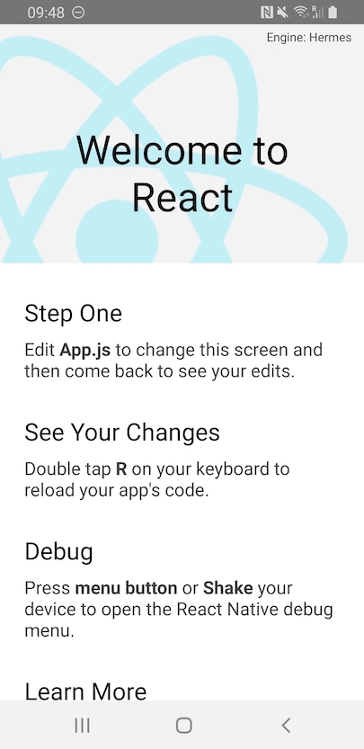
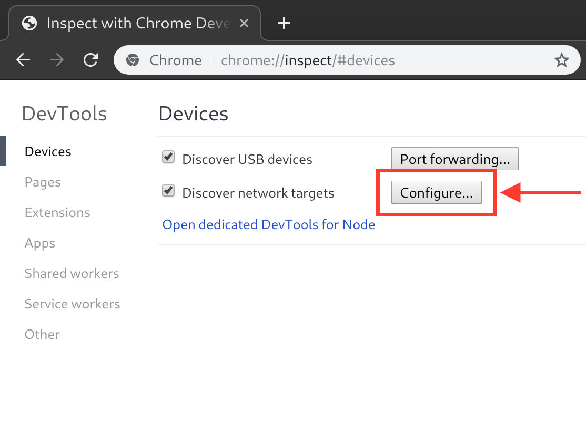
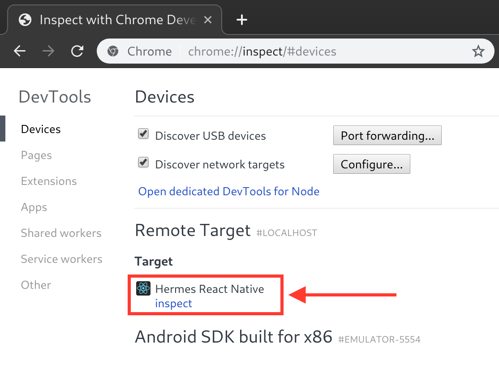
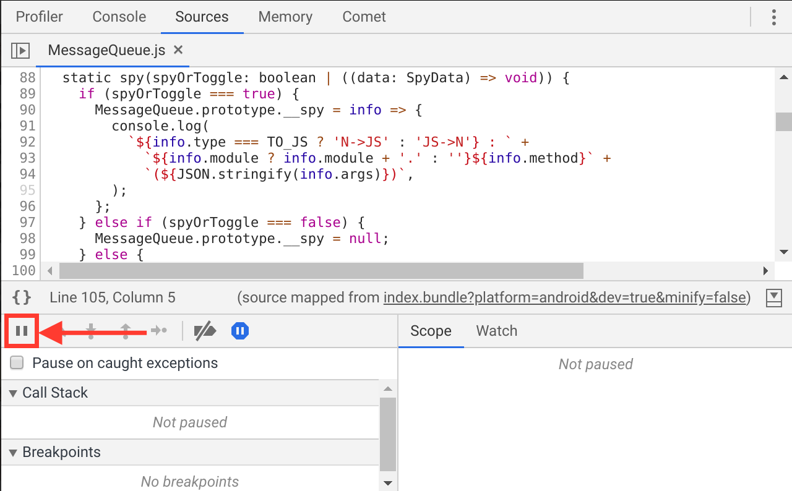

# Использование Hermes


[Hermes](https://hermesengine.dev) — это JavaScript-движок с открытым исходным кодом, оптимизированный для React Native. Для многих приложений использование Hermes приведет к улучшению времени запуска, снижению использования памяти и уменьшению размера приложения по сравнению с JavaScriptCore.

Hermes используется по умолчанию в React Native, и для его включения не требуется дополнительных настроек.

## Пакетный Hermes

React Native поставляется с **комплектованной версией** Hermes.

Мы будем собирать версию Hermes для вас всякий раз, когда будем выпускать новую версию React Native. Это гарантирует, что вы будете использовать версию Hermes, полностью совместимую с версией React Native, которую вы используете.

Исторически у нас были проблемы с согласованием версий Hermes с версиями React Native. Это полностью устраняет эту проблему и предлагает пользователям JS-движок, совместимый с конкретной версией React Native.

Это изменение полностью прозрачно для пользователей React Native. Вы по-прежнему можете отключить Hermes с помощью команды, описанной на этой странице.

Вы можете [подробнее о технической реализации на этой странице](bundled-hermes.md).

## Подтверждение использования Hermes

Если вы недавно создали новое приложение с нуля, вы должны увидеть, включен ли Hermes, в окне приветствия:



Глобальная переменная `HermesInternal` будет доступна в JavaScript, которую можно использовать для проверки того, что Hermes используется:

```jsx
const isHermes = () => !!global.HermesInternal;
```

!!!warning ""

    Если вы используете нестандартный способ загрузки пакета JS, возможно, что переменная `HermesInternal` доступна, но вы не используете высоко оптимизированный предварительно скомпилированный байткод.

    Убедитесь, что вы используете файл `.hbc`, а также проведите сравнение до и после, как описано ниже.

Чтобы убедиться в преимуществах Hermes, попробуйте сделать релизную сборку/развертывание вашего приложения для сравнения. Например:

```shell
$ npx react-native run-android --mode release
```

или для iOS:

```shell
$ npx react-native run-ios --mode Release
```

Это позволит компилировать JavaScript в байткод во время сборки, что улучшит скорость запуска вашего приложения на устройстве.

## Отладка JS на Hermes с помощью DevTools Google Chrome

Hermes поддерживает отладчик Chrome, реализуя протокол инспектора Chrome. Это означает, что инструменты Chrome можно использовать для прямой отладки JavaScript, запущенного на Hermes, на эмуляторе или на реальном, физическом, устройстве.

!!!info ""

    Обратите внимание, что это очень отличается от "Удаленной отладки JS" из меню In-App Dev, описанного в разделе [Отладка](debugging.md#debugging-using-a-custom-javascript-debugger), которая фактически запускает JS-код на V8 Chrome на вашей машине разработки (ноутбуке или настольном компьютере).

Chrome подключается к Hermes, запущенному на устройстве, через Metro, поэтому вам нужно знать, где Metro слушает. Обычно это `localhost:8081`, но это [настраивается](https://facebook.github.io/metro/docs/configuration). При запуске `yarn start` адрес записывается в stdout при запуске.

Как только вы узнаете, где прослушивается сервер Metro, вы сможете подключиться к Chrome, выполнив следующие действия:

**1.** Перейдите по адресу `chrome://inspect` в экземпляре браузера Chrome.

**2.** Используйте кнопку `Configure...`, чтобы добавить адрес сервера Metro (обычно `localhost:8081`, как описано выше).




**3.** Теперь вы должны увидеть цель "Hermes React Native" со ссылкой "inspect", которую можно использовать для запуска отладчика. Если вы не видите ссылку "inspect", убедитесь, что сервер Metro запущен.



**4.** Теперь вы можете использовать инструменты отладки Chrome. Например, чтобы поставить точку останова при следующем запуске JavaScript, нажмите на кнопку паузы и вызовите действие в вашем приложении, которое приведет к выполнению JavaScript.



## Включение Hermes на старых версиях React Native

Hermes является движком по умолчанию начиная с версии React Native 0.70. В этом разделе объясняется, как включить Hermes на старых версиях React Native.

Во-первых, убедитесь, что вы используете как минимум версию 0.60.4 React Native для включения Hermes на Android или 0.64 React Native для включения Hermes на iOS.

Если у вас уже есть приложение, основанное на более ранней версии React Native, вам придется сначала обновить его. Как это сделать, смотрите в разделе [Обновление до новых версий React Native](upgrading.md). После обновления приложения убедитесь, что все работает, прежде чем пытаться перейти на Hermes.

!!!warning "Примечание для совместимости с React Native"

    Каждый релиз Hermes ориентирован на определенную версию RN. Эмпирическое правило — всегда строго следовать [релизам Hermes](https://github.com/facebook/hermes/releases).

    Несовпадение версий может привести к мгновенному краху ваших приложений в худшем случае.

!!!info "Примечание для пользователей Windows"

    Для работы Hermes требуется [Microsoft Visual C++ 2015 Redistributable](https://www.microsoft.com/en-us/download/details.aspx?id=48145).

### Android

Отредактируйте файл `android/gradle.properties` и убедитесь, что `hermesEnabled` равно `true`:

```diff
# Use this property to enable or disable the Hermes JS engine.
# If set to false, you will be using JSC instead.
hermesEnabled=true
```

!!!note ""

    Это свойство было добавлено в React Native 0.71. Если вы не можете найти его в файле `gradle.properties`, обратитесь к документации для соответствующей версии React Native, которую вы используете.

Также, если вы используете ProGuard, вам нужно добавить эти правила в `proguard-rules.pro` :

```
-keep class com.facebook.hermes.unicode.** { *; }
-keep class com.facebook.jni.** { *; }
```

Далее, если вы уже создавали свое приложение хотя бы один раз, очистите сборку:

```shell
$ cd android && ./gradlew clean
```

Вот и все! Теперь вы можете разрабатывать и развертывать свое приложение как обычно:

```shell
$ npx react-native run-android
```

### iOS

Начиная с версии React Native 0.64, Hermes также работает на iOS. Чтобы включить Hermes для iOS, отредактируйте файл `ios/Podfile` и внесите изменения, показанные ниже:

```diff
   use_react_native!(
     :path => config[:reactNativePath],
     # to enable hermes on iOS, change `false` to `true` and then install pods
     # By default, Hermes is disabled on Old Architecture, and enabled on New Architecture.
     # You can enable/disable it manually by replacing `flags[:hermes_enabled]` with `true` or `false`.
-    :hermes_enabled => flags[:hermes_enabled],
+    :hermes_enabled => true
   )
```

По умолчанию вы будете использовать Hermes, если вы находитесь на Новой архитектуре. Указав значение, например
`true` или `false`, вы можете включить/выключить Hermes по своему усмотрению.

После того, как вы настроили его, вы можете установить капсулы Hermes с помощью:

```shell
$ cd ios && pod install
```

Вот и все! Теперь вы можете разрабатывать и развертывать свое приложение как обычно:

```shell
$ npx react-native run-ios
```

## Переключение обратно на JavaScriptCore

React Native также поддерживает использование JavaScriptCore в качестве [JavaScript engine](javascript-environment.md). Следуйте этим инструкциям, чтобы отказаться от Hermes.

### Android

Отредактируйте файл `android/gradle.properties` и верните значение `hermesEnabled` в `false`:

```diff
# Use this property to enable or disable the Hermes JS engine.
# If set to false, you will be using JSC instead.
hermesEnabled=false
```

### iOS

Отредактируйте файл `ios/Podfile` и внесите изменения, показанные ниже:

```diff
   use_react_native!(
     :path => config[:reactNativePath],
     # Hermes is now enabled by default. Disable by setting this flag to false.
     # Upcoming versions of React Native may rely on get_default_flags(), but
     # we make it explicit here to aid in the React Native upgrade process.
-    :hermes_enabled => flags[:hermes_enabled],
+    :hermes_enabled => false,
   )
```
