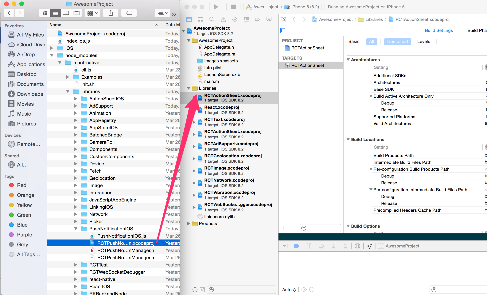
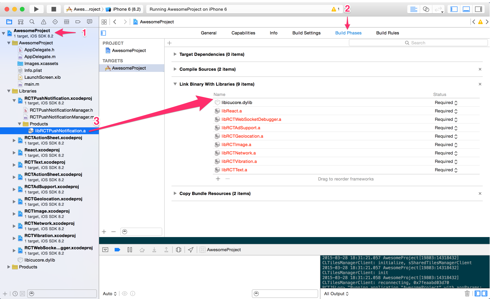
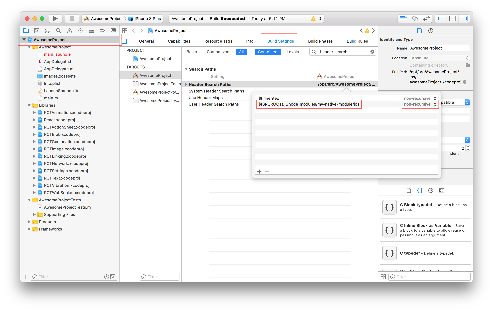

# Связывание библиотек

Не каждое приложение использует все нативные возможности, и включение кода для поддержки всех этих возможностей повлияет на размер бинарного файла... Но мы все равно хотим поддерживать добавление этих функций, когда они вам понадобятся.

В связи с этим мы представили многие из этих функций в виде независимых статических библиотек.

Для большинства библиотек это будет так же быстро, как перетащить два файла, иногда потребуется третий шаг, но не более того.

!!!info "Примечание"

    Все библиотеки, которые мы поставляем с React Native, находятся в папке `Libraries` в корне репозитория. Некоторые из них являются чистым JavaScript, и вам нужно только `require`.

    Другие библиотеки также полагаются на некоторый нативный код, и в этом случае вам придется добавить эти файлы в ваше приложение, иначе приложение выдаст ошибку, как только вы попытаетесь использовать библиотеку.

## Вот несколько шагов для линковки библиотек, содержащих нативный код.

### Автоматическое связывание

Установите библиотеку с нативными зависимостями:

```shell
npm install <library-with-native-dependencies> --save
```

!!!info ""

    Флаг `--save` или `--save-dev` очень важен для этого шага. React Native свяжет ваши библиотеки на основе `dependencies` и `devDependencies` в вашем файле `package.json`.

Вот и все! В следующий раз, когда вы соберете свое приложение, нативный код будет связан благодаря механизму [autolinking](https://github.com/react-native-community/cli/blob/main/docs/autolinking.md).

### Ручное связывание

#### Шаг 1

Если библиотека содержит нативный код, в ее папке должен быть файл `.xcodeproj`. Перетащите этот файл в свой проект в Xcode (обычно в группе `Libraries` в Xcode);



#### Шаг 2

Нажмите на ваш основной файл проекта (тот, который представляет собой `.xcodeproj`), выберите `Build Phases` и перетащите статическую библиотеку из папки `Products` внутрь импортируемой библиотеки в `Link Binary With Libraries`.



#### Шаг 3

Не для каждой библиотеки потребуется этот шаг, но вам нужно подумать вот о чем: _Нужно ли мне знать содержимое библиотеки во время компиляции?_

Это означает, что вы используете эту библиотеку на родном языке или только в JavaScript? Если вы используете ее только в JavaScript, то все в порядке!

Если же вам нужно вызывать ее из родного языка, то нам нужно знать заголовки библиотеки. Для этого нужно зайти в файл проекта, выбрать `Build Settings` и найти `Header Search Paths`. Там вы должны указать путь к вашей библиотеке. (Раньше в этой документации рекомендовалось использовать `recursive`, но теперь это не рекомендуется, так как это может вызвать тонкие сбои сборки, особенно с CocoaPods).


