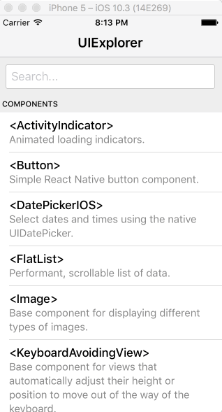
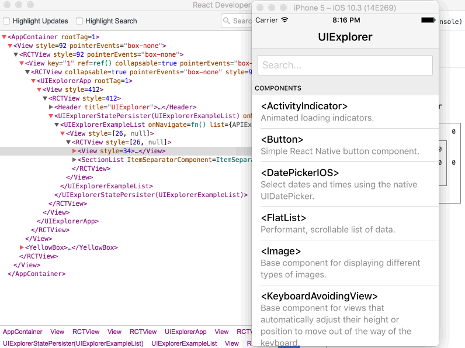
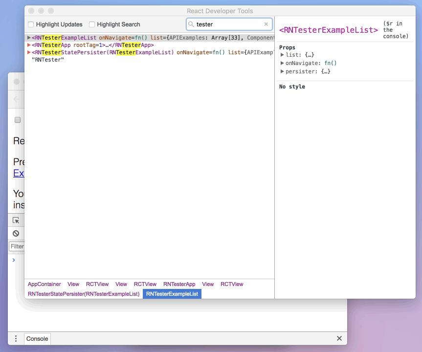

# React Dev Tools

Вы можете использовать [автономную версию React Developer Tools](https://github.com/facebook/react/tree/main/packages/react-devtools) для отладки иерархии компонентов React. Чтобы использовать его, установите пакет `react-devtools` глобально:

=== "npm"

    ```shell
    npm install -g react-devtools
    ```

=== "yarn"

    ```shell
    yarn global add react-devtools
    ```

---

Теперь запустите `react-devtools` из терминала, чтобы запустить автономное приложение DevTools. Оно должно подключиться к вашему симулятору в течение нескольких секунд.

```shell
react-devtools
```


!!! info ""

    Если подключение к эмулятору окажется проблематичным (особенно для Android 12), попробуйте запустить `adb reverse tcp:8097 tcp:8097` в новом терминале.

!!!info ""

    Если вы предпочитаете избегать глобальных установок, вы можете добавить `react-devtools` в качестве зависимости от проекта. Добавьте пакет `react-devtools` в ваш проект с помощью `npm install --save-dev react-devtools`, затем добавьте `"react-devtools": "react-devtools"` в раздел `scripts` в вашем `package.json`, а затем запустите `npm run react-devtools` из папки проекта, чтобы открыть DevTools.

## Интеграция с React Native Inspector

Откройте меню Dev и выберите "Toggle Inspector". Появится наложение, позволяющее нажать на любой элемент пользовательского интерфейса и просмотреть информацию о нем:



Однако, когда `react-devtools` запущен, Inspector переходит в свернутый режим и вместо этого использует DevTools в качестве основного пользовательского интерфейса. В этом режиме щелчок на чем-либо в симуляторе вызовет соответствующие компоненты в DevTools:



Вы можете выбрать "Toggle Inspector" в том же меню, чтобы выйти из этого режима.

## Инспектирование экземпляров компонентов

При отладке JavaScript в Chrome вы можете проверить реквизиты и состояние компонентов React в консоли браузера.

Сначала выполните инструкции по отладке в Chrome, чтобы открыть консоль Chrome.

Убедитесь, что в выпадающем списке в левом верхнем углу консоли Chrome написано `debuggerWorker.js`. _Этот шаг очень важен_.

Затем выберите компонент React в React DevTools. В верхней части есть окно поиска, которое поможет вам найти компонент по имени. Как только вы его выберете, он будет доступен как `$r` в консоли Chrome, что позволит вам просмотреть его реквизиты, состояние и свойства экземпляра.



## Отладка состояния приложения

[Reactotron](https://github.com/infinitered/reactotron) - это настольное приложение с открытым исходным кодом, которое позволяет проверять состояние приложений Redux или MobX-State-Tree, а также просматривать пользовательские журналы, выполнять пользовательские команды, такие как сброс состояния, сохранение и восстановление снимков состояния, и другие полезные функции отладки для приложений React Native.

Вы можете просмотреть инструкции по установке [в README](https://github.com/infinitered/reactotron). Если вы используете Expo, вот статья с подробным описанием [как установить на Expo](https://shift.infinite.red/start-using-reactotron-in-your-expo-project-today-in-3-easy-steps-a03d11032a7a).
