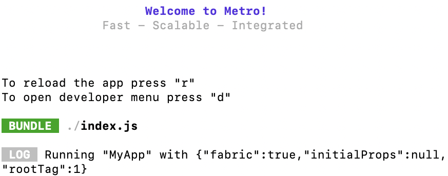

# Создание нового архитектурного приложения

!!!warning "Внимание"

    Эта документация все еще является **экспериментальной**, и детали могут быть изменены по мере итераций. Не стесняйтесь делиться своими отзывами в [обсуждении внутри рабочей группы](https://github.com/reactwg/react-native-new-architecture/discussions/8) для этой страницы.

    Более того, она содержит несколько **ручных шагов**. Пожалуйста, обратите внимание, что это не будет представлять окончательный опыт разработчиков, когда Новая архитектура станет стабильной. Мы работаем над инструментами, шаблонами и библиотеками, которые помогут вам быстро начать работу с новой архитектурой без необходимости проходить всю процедуру настройки.

Эта страница поможет вам создать новое приложение React Native, использующее новую архитектуру.

## Среда разработки

Прежде чем продолжить, убедитесь, что вы выполнили все шаги в разделе [Настройка среды разработки](getting-started.md) на вкладке **React Native CLI Quickstart**.

Если вы следуете руководству по настройке, остановитесь, когда дойдете до раздела **Запуск приложения React Native**, и продолжите следовать этому руководству.

!!!warning ""

    Если вы используете Expo, вы не можете включить новую архитектуру в настоящее время, и вам придется подождать будущего выпуска Expo SDK.

## Creating a New Application

!!!warning ""

    Если вы ранее установили глобальный пакет `react-native-cli`, пожалуйста, удалите его, так как он может вызвать непредвиденные проблемы:

    ```
    npm uninstall -g react-native-cli @react-native-community/cli
    ```

Если у вас уже настроена среда разработки, создайте новый проект React Native на основе шаблона:

```shell
npx react-native@latest init AwesomeProject
```

!!!warning ""

    Новая архитектура доступна в React Native версии 0.68 или более поздней.

## Конфигурация

Выполните следующие шаги, чтобы включить новую архитектуру и создать приложение.

### Включите Hermes

Hermes — это движок JavaScript с открытым исходным кодом, оптимизированный для React Native. [Hermes станет движком по умолчанию в будущем](https://github.com/reactwg/react-native-new-architecture/discussions/4), и мы настоятельно рекомендуем вам использовать его.

Пожалуйста, [следуйте инструкциям на сайте React Native](hermes.md), чтобы включить Hermes в вашем приложении.

### Включить новую архитектуру

#### Целевая ОС

=== "iOS"

    Перейдите в каталог `ios` и выполните следующее:

    ```shell
    # from `ios` directory
    bundle install && RCT_NEW_ARCH_ENABLED=1 bundle exec pod install
    ```

    Затем создайте и запустите приложение как обычно:

    ```shell
    yarn ios
    ```

    !!!note ""

    	Вам нужно будет запускать `pod install` каждый раз, когда зависимость с нативным кодом изменится. Упростите выполнение этой команды, добавив ее в `scripts` в файл `package.json` вашего проекта:

    	```json
    	"scripts": {
    		"pod-install": "RCT_NEW_ARCH_ENABLED=1 bundle exec pod install"
    	}
    	```

    	и запустите его с помощью `yarn pod-install`. Обратите внимание, что `bundle install` не нужно запускать второй раз, если Gemfile не изменился.

    #### Устранение неполадок

    ##### `react-native run-ios` не работает

    Если вы видите ошибку при сборке с помощью `react-native run-ios`, возможно, в кэше остались файлы от предыдущей сборки со старой архитектурой. Очистите кэш сборки и повторите попытку:

    1.  Откройте проект `ios/project.xcworkspace` в Xcode
    2.  В XCode выберите Product > Clean Build Folder.
    3.  В директории проекта удалите файл `ios/Podfile.lock` и директорию `ios/Pods`: `rm -rf ios/Podfile.lock ios/Pods`.
    4.  Повторно запустите `yarn pod-install` и `yarn ios`.

=== "Android"

    Установите свойство `newArchEnabled` в `true` с помощью **either**:

    -   Изменив соответствующую строку в файле `android/gradle.properties`.
    -   Установив переменную окружения `ORG_GRADLE_PROJECT_newArchEnabled=true`.

    Затем соберите и запустите приложение как обычно:

    ```shell
    yarn android
    ```

    !!!note ""

    	Вы можете заметить увеличение времени сборки с новой архитектурой из-за дополнительного этапа компиляции C++ с Android NDK. Чтобы улучшить время сборки, смотрите [Speeding Up Your Build Phase](build-speed.md).

### Подтверждение использования новой архитектуры

После сборки и запуска приложения, когда Metro обслуживает пакет JavaScript, вы должны увидеть `"fabric": true` в журналах Metro:



### Хотите узнать больше?

Если вы хотите просмотреть изменения кода, относящиеся к Новой архитектуре, посмотрите на [помощник обновления с версии 0.67.4 до 0.68.0](https://react-native-community.github.io/upgrade-helper/?from=0.67.4&to=0.68.0). Файлы, которые были добавлены для Новой архитектуры, отмечены желтым баннером.

Для более подробного объяснения того, что делает каждый файл, ознакомьтесь с этими руководствами, в которых изменения рассматриваются шаг за шагом: [Enabling The New Architecture in Your App](new-architecture-app-intro.md)
